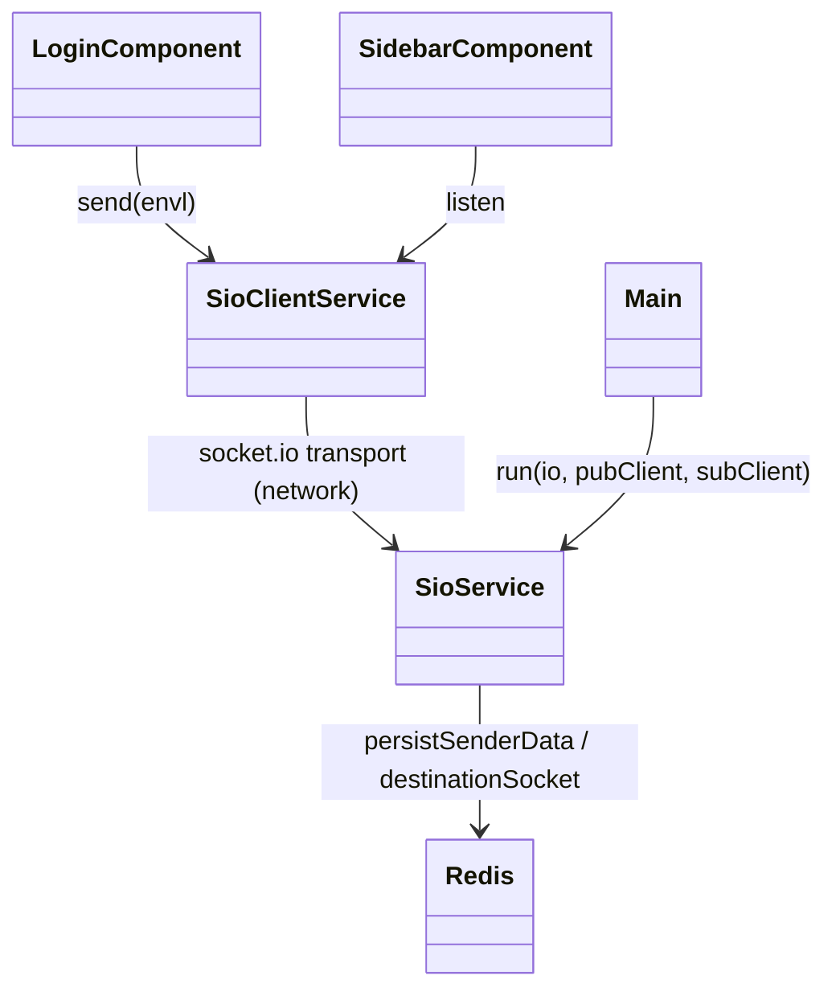
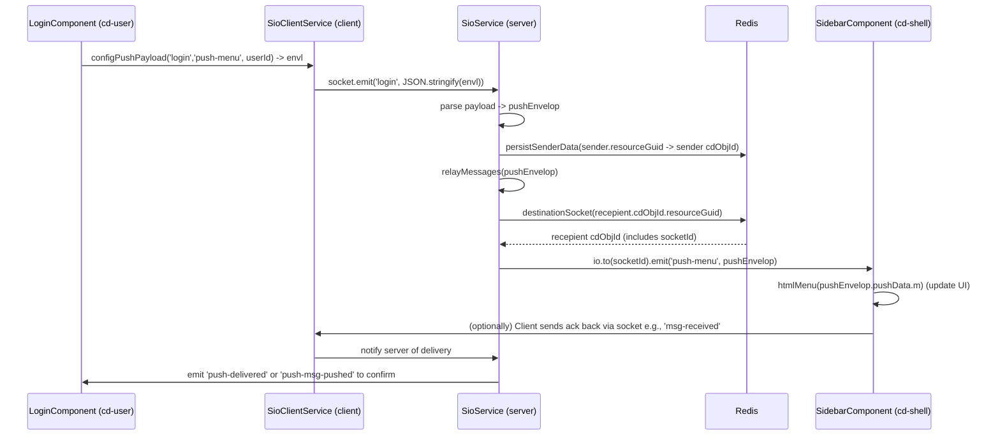
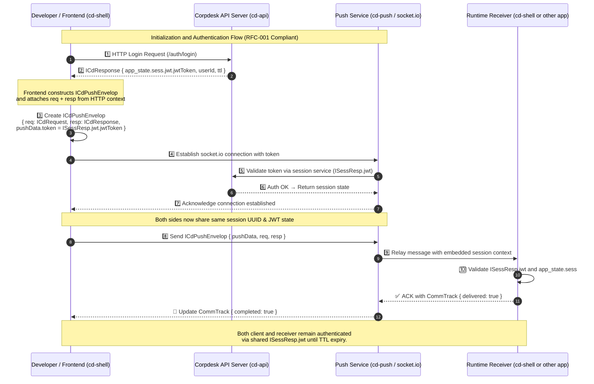
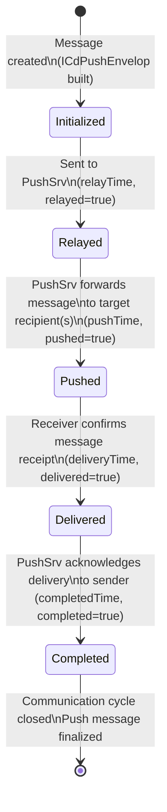
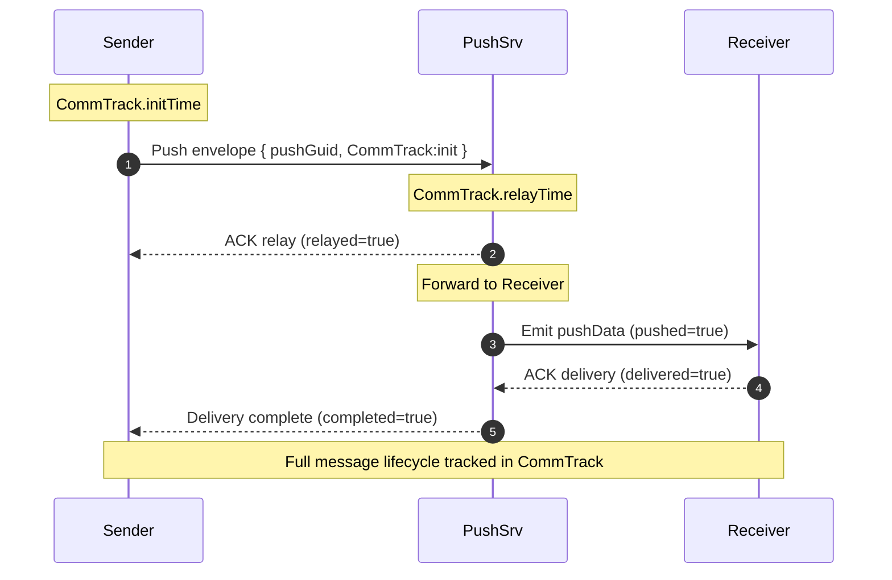

Nice — thanks for all the source code. I read it top-to-bottom and put together a focused, developer-level reference for **cd-push** (socket.io / wss) that ties the Angular client pieces, the `cd-sio` server, Redis persistence, and the shell (`SidebarComponent`) together.

I’ll include:

* A clear overview of components and responsibilities
* Key data structures and life-cycle of a push envelope
* A class diagram (mermaid)
* A sequence diagram for the **login → push → sidebar menu** flow (mermaid)
* A flowchart of server relay logic (mermaid)
* Where to add logging / instrumentation for debugging
* Troubleshooting checklist and recommended tests
* Small suggestions for improvements and safe hacking points

---

# cd-push technical documentation (developer guide)

## High level overview

`cd-push` is a general-purpose push/notification relay used to synchronize state or notify remote modules (module-federation remotes and shell) in Corpdesk. It supports two transport backends:

* **socket.io** (primary/production when `config.pushService.sio.enabled` is `true`) — runs as `cd-sio` (usually on a separate port/process)
* **WebSocket** (`wss`) backend (when `config.pushService.wss.enabled`)

Key goals:

* Allow a client module (e.g., `cd-user`) to notify another module (e.g., `cd-shell` Sidebar) of state changes (login success with menu) using `ICdPushEnvelop`.
* Track message lifecycle (`commTrack`) across relay/push/delivery/completion.
* Persist the sender resource metadata in Redis so server can find socket id(s) later.

Core pieces:

* Client side:

  * `SioClientService` (socket.io client wrapper — provided in Angular lib)
  * `LoginComponent` (example sender)
  * `SidebarComponent` (example receiver in shell)
* Server side:

  * `Main` (starts server, configures socket.io or wss)
  * `SioService` (server push logic, registered events, redis persistence, relayMessages)
  * Redis (used as storage for resource -> socket info)
* Common types:

  * `ICdPushEnvelop`, `ICommConversationSub`, `ISocketItem`, `CommTrack`, `PushEvent`

---

## Important files & responsibilities

### Client

* `SioClientService` (Angular library)

  * Connects to push server (`io(this.env.sioEndpoint, this.env.sioOptions)`)
  * Offers methods:

    * `initSio(cls, action)` — set up listeners & provide callbacks
    * `sendPayLoad(pushEnvelope)` — stringifies envelope and `socket.emit(triggerEvent, msg)`
    * `listenSecure(emittEvent, ...)` — helper to attach client-side listeners
  * Maintains `appSockets` and writes `CdObjId` entries to `localStorage` for the resource.

* `LoginComponent` (sender)

  * After successful login calls `configPushPayload('login','push-menu', userId)` to create the envelope
  * Calls `svSioTest.sendMessage(triggerEvent, envl)` (a wrapper to emit through socket client)
  * Also registers local resource to localStorage (so the server can later map resourceGuid -> socket)

* `SidebarComponent` (receiver)

  * Subscribes to `push-menu`, `push-registered-client`, etc.
  * Receives `push-menu` to populate the shell menu and saves `appSockets` for later.

### Server

* `Main`:

  * Boots an https server and creates `new Server(httpsServer, { cors: ... })` when `sio.enabled`
  * Creates Redis `pubClient/subClient` and calls `SioService.run(io, pubClient, subClient)`

* `SioService`:

  * `getRegisteredEvents()` — returns `PushEvent[]` mapping `triggerEvent` → `emittEvent` and server handler type (sFx)
  * `runRegisteredEvents(socket, io, pubClient)` — attaches `socket.on(e.triggerEvent, ...)` handlers
  * `persistSenderData(sender, socket, pubClient)` — stores sender metadata in Redis (`wsRedisCreate(k,v)`)
  * `relayMessages(pushEnvelop, io, pubClient)` — the main relay logic:

    * For each `pushRecepients`:

      * lookup recepient socket info from Redis (`destinationSocket`)
      * depending on `subTypeId` decide to:

        * respond to sender (subTypeId === 1)
        * send to recepients (subTypeId === 7)
      * update `commTrack` fields: `relayTime`, `pushed`, `deliveryTime`, `delivered`, `completed` appropriately
      * emit `io.to(socketId).emit(emittEvent, payload)` for client side events

* Redis:

  * Stores sender `CdObjId` keyed by `resourceGuid` so server can look up socket id(s).

---

## Key data structures (short)

```ts
interface ICdPushEnvelop {
  pushData: {
    appId?: string;
    appSockets?: ISocketItem[]; // list of known sockets for the app (appInit)
    pushGuid: string;
    m?: string; // message or payload (often JSON-stringified menu)
    pushRecepients: ICommConversationSub[];
    triggerEvent: string;  // event that server listens on
    emittEvent: string;    // event that server emits to clients
    token: string;
    commTrack: CommTrack;
    isNotification: boolean | null;
    isAppInit?: boolean | null;
  };
  req: ICdRequest | null;
  resp: ICdResponse | null;
}

interface ICommConversationSub {
  userId: number;
  subTypeId: number; // 1=sender, 7=recepient (common)
  cdObjId: CdObjId;  // { resourceGuid, socketId, ... }
}
```

`CommTrack` tracks lifecycle times and flags:

* `initTime` — when push envelope created client-side
* `relayTime` — when server relayed to receiver(s)
* `pushTime` — when server pushed to recepient socket
* `deliveryTime`, `delivered`, `completedTime`, `completed` — subsequent ack flags

---

## High level envelope lifecycle (bulleted)

1. Client (Login): create `ICdPushEnvelop` with:

   * `pushRecepients` including sender (subTypeId=1) and intended receiver (subTypeId=7) with their `cdObjId` (receiver `cdObjId` is read from localStorage `sidebarInitData`).
   * `isAppInit` may be set to indicate initial registration (app init).
   * `commTrack.initTime` set to `Date.now()`.
2. Client emits: `socket.emit(pushEnvelop.pushData.triggerEvent, JSON.stringify(pushEnvelop))`.
3. Server `SioService` receives event handler for `triggerEvent`:

   * Parses payload: `const pushEnvelop: ICdPushEnvelop = JSON.parse(payLoad)`
   * Finds `sender` via `getSender(pushEnvelop.pushData.pushRecepients)`
   * Calls `persistSenderData(sender, socket, pubClient)` to persist sender `cdObjId` to Redis (using `resourceGuid` as key).
   * If `commTrack.completed` is true — handle completion; otherwise call `relayMessages`.
4. `relayMessages`:

   * For each recepient in `pushRecepients`:

     * `destinationSocket(recepient)` reads Redis to find saved `cdObjId` (which includes the `socketId` stored earlier in persistSenderData).
     * If found, server uses `io.to(recepientSocketId).emit(emittEvent, pushEnvelopToSend)`.
   * Server updates `commTrack` flags/timestamps (e.g., `relayTime`, `pushed`, `pushTime`).
   * For sender (subTypeId=1) server may respond with `push-registered-client` (for app init) or `push-msg-relayed`/`push-delivered` to acknowledge the sender.
5. Client receivers (Sidebar) receive `push-menu` event (or similar), read payload, update UI (menu), and may send confirmation back (message-completed, msg-received) to close lifecycle.

---

## Mermaid diagrams

### 1) Class diagram (main components)




### 2) Sequence diagram — login → push → sidebar menu



Perfect 👍 — below is the **updated sequence diagram** that reflects the **RFC-compliant authentication flow** using `ICdPushEnvelop`, `ICdResponse`, and `ISessResp`.

It now shows how:

* Every push message originates from an authenticated HTTP transaction
* The `req` and `resp` are embedded into the envelope
* The JWT and session metadata in `ISessResp` are validated during the socket handshake
* Both layers (HTTP + WebSocket) share a single session context for full state continuity

---

### 🧭 **[Revised]Sequence Diagram — cd-push Authentication & Handshake Flow**



---

### ⚙️ **Narrative Summary**

| Step     | Description                                                                                                                                    |
| -------- | ---------------------------------------------------------------------------------------------------------------------------------------------- |
| **1–2**  | Developer authenticates via HTTP → receives `ICdResponse` with embedded `ISessResp` (including JWT + TTL).                                     |
| **3**    | The client constructs a `ICdPushEnvelop`, embedding the original HTTP `req` and `resp` objects to preserve context.                            |
| **4–7**  | A WebSocket (Socket.IO) connection is opened using the same JWT. The push server (`cd-push`) validates this against the Corpdesk Auth service. |
| **8–9**  | The authenticated envelope is sent to the receiver, still carrying its session metadata.                                                       |
| **10–✅** | The receiver validates and acknowledges receipt through `CommTrack`. Both sides maintain synchronized state until session TTL expires.         |

---

### 🧩 **Design Implications**

* The **`ICdPushEnvelop`** is the single source of truth for both authentication and message context.
* No parallel JWT headers or secondary token exchanges are required.
* The **push pipeline** is cryptographically bound to the same session as HTTP.
* **CommTrack** ensures end-to-end delivery traceability, confirming continuity from request → response → push → delivery.

---

Would you like me to now extend this with a **state diagram** that shows how `CommTrack` evolves through the handshake lifecycle (e.g., `initialized → relayed → pushed → delivered → completed`)?
That would complete the documentation of both **auth continuity** and **message state flow**.


Excellent ✅ — here’s the **CommTrack State Lifecycle Diagram** and accompanying explanation.
This completes the documentation of **end-to-end cd-push communication flow** — from initialization, through authenticated relay, to delivery acknowledgment.

---

## 🧭 **CommTrack Lifecycle: State Machine Overview**

The `CommTrack` interface tracks every stage of message flow within a `ICdPushEnvelop`.
Each stage corresponds to a real-time state transition between the **sender**, **server**, and **receiver** — ensuring reliable, traceable communication.

---

### ⚙️ **CommTrack Interface (Recap)**

```ts
export interface CommTrack {
  initTime: number | null;
  relayTime: number | null;
  relayed: boolean;
  pushed: boolean;
  pushTime: number | null;
  deliveryTime: number | null;
  delivered: boolean;
  completed: boolean;
  completedTime: number | null;
}
```

Each field captures a moment or condition in the message lifecycle, acting like a distributed transaction log for push communication.

---

### 🧩 **State Transition Flow**



---

### 🧩 **Detailed Description of Each State**

| **State**       | **Description**                                                                   | **Triggered By**                             | **Data Updated**                  |
| --------------- | --------------------------------------------------------------------------------- | -------------------------------------------- | --------------------------------- |
| **Initialized** | Message constructed at sender, assigned `pushGuid`, and `CommTrack.initTime` set. | Sender (e.g. LoginComponent, Dev-Sync agent) | `initTime`                        |
| **Relayed**     | Push envelope reaches the cd-push service and is accepted for routing.            | PushSrv (socket.io gateway)                  | `relayTime`, `relayed=true`       |
| **Pushed**      | PushSrv emits message to target receivers (possibly multiple subscribers).        | PushSrv                                      | `pushTime`, `pushed=true`         |
| **Delivered**   | Receiver acknowledges receipt (via ACK message).                                  | Receiver (cd-shell or another module)        | `deliveryTime`, `delivered=true`  |
| **Completed**   | Sender is notified of successful delivery; end-to-end trace confirmed.            | PushSrv                                      | `completedTime`, `completed=true` |

---

### 📊 **Sequence and Timing Example**



---

### 🧠 **Design Highlights**

* ✅ **Stateful Continuity:** CommTrack persists across all components — sender, push server, and receiver — ensuring unified delivery tracking.
* 🔐 **Auth-Linked:** Each CommTrack entry is tied to a valid `ISessResp.jwt`, preserving traceability within an authenticated session.
* 🧩 **Diagnostics:** Developers or automated agents can inspect `CommTrack` to diagnose latency or failed delivery stages.
* 🔄 **Idempotent Resilience:** If a connection drops mid-cycle, replay attempts can resume from the last known CommTrack stage rather than restarting the full transaction.

---

### 🧱 **Integration with Dev-to-Runtime Sync**

When the **Dev-Sync module** emits a synchronization event (e.g. triggered by save or CLI agent),
it uses the same push envelope model — meaning that every runtime update,
even within the development pipeline, is **observable**, **auditable**, and **recoverable** through `CommTrack`.

---

Would you like me to now add a **data flow diagram** that shows how the *req/resp + pushData + CommTrack* move between components (`cd-shell`, `cd-push`, and `cd-api`) — forming the complete data lifecycle from HTTP to WebSocket?


### 3) Server relay flow (flowchart)

```mermaid
flowchart TD
  A[Socket event received (triggerEvent)] --> B{Parse envelope}
  B --> C[Find sender in envelope]
  C --> D[Persist sender -> Redis]
  D --> E{commTrack.completed?}
  E -- Yes --> F[Process completion (noop/cleanup)]
  E -- No --> G[For each pushRecepient]
  G --> H[Lookup recepient via Redis]
  H --> I{Recepient found?}
  I -- No --> J[Log: recepient not connected]
  I -- Yes --> K[Prepare pushEnvelop copy]
  K --> L[Set commTrack.relayTime/pushed/pushTime]
  L --> M[io.to(socketId).emit(emittEvent, pushEnvelop)]
  M --> N[Optional: wait for ack messages from client]
  N --> O[Update commTrack delivered/completed]
```

---

## Where to add logging & instrumentation (for debugging)

Add logs (or temporary console.logs) at these hot spots (server & client):

### Client (Angular)

* Before `socket.emit(...)` inside `sendPayLoad()` — log the `triggerEvent` and truncated envelope.
* After `localStorage.setItem(key, ...)` in `configPushPayload` and `registerResource` — log the `resourceGuid` and stored `cdObjId`.
* In `listenSecure()` — log when an event is received and the `emittEvent` name.

*Why:* Verify that the client actually emitted the event, and that the `cdObjId` stored in localStorage matches the shell's expectation.

### Server (`SioService`)

Add/verify logs at:

* At top of `socket.on(e.triggerEvent, ...)` — log `e.triggerEvent`, `socket.id`, and envelope summary (sender resourceGuid, pushRecepients).
* `persistSenderData()` — log key and value written to redis and result.
* `destinationSocket()` — log key queried and returned value (or null).
* At start of `relayMessages()` — log `pushEnvelop.pushData.triggerEvent`, `pushRecepients` list.
* For each `io.to(socketId).emit(...)` — log `emittEvent`, `recepientSocketId`, and first 300 chars of payload.
* When sending the `push-registered-client` (app init) response — log explicit message and socket id.

This will let you prove the path: client -> server -> redis write -> redis read -> emit -> client.

---

## Troubleshooting checklist (when you see “Could not resolve …” or messages not appearing)

> Note: previous errors you had (Vite build failing to resolve `.js` imports) were because the generated `view` controllers were still class definitions (ESM `export class SignInController`) instead of `export const ctlSignIn = { ... }`. That’s separate to push; here, focus on push behavior.

1. **Verify client actually sends event**

   * On client dev console, ensure `sendPayLoad()` logs the event & envelope.
   * Check `Network` (WS frames) with browser devtools (socket.io frames) — confirm `login` event frame sent.

2. **Verify server receives event**

   * Add logs to `socket.on('login', ...)` handler (SioService.runRegisteredEvents) — you should see the server log when the event arrives.

3. **Check persisted sender data**

   * After server receives, `persistSenderData()` writes to Redis:

     * log the returned Redis result
     * use a Redis client shell (`redis-cli`) to `GET` the `resourceGuid` key to ensure presence.

4. **Verify destination socket lookup**

   * The server does `destinationSocket(recepient)` by reading redis for the recepient `resourceGuid`. Confirm the entry exists and contains `cdObjId.socketId` with a valid socket id.

5. **Confirm `io.to(socketId).emit(...)` is called**

   * Add logs right before the `emit` — note the `socketId` and `emittEvent` used.

6. **Confirm receiver receives the event**

   * In `SidebarComponent.listen` / `SioClientService.listenSecure` ensure you see the log when `push-menu` arrives.
   * If not, check:

     * Are `socket.id`s matching? (socketId persisted vs actual active id)
     * Are there multiple nodes/processes (cluster) causing adapter/redis mismatch? `io.adapter(createAdapter(pubClient, subClient))` must be correctly configured; check adapter logs.

7. **Look for race conditions**

   * If the client registers resource after the server tried to lookup recepient, server would not find recepient. The standard flow is:

     * registration: client does `registerResource()` (sends `register-client` / app-init) and server responds with `push-registered-client` containing `appSockets`.
     * login: later `login` event includes recepient `cdObjId` (from localStorage). Ensure localStorage has valid `sidebarInitData` (Shell must have saved it earlier).

8. **Edge cases to watch**

   * Different environment values (`appId`, `ngModule`) mismatch between sender and receiver.
   * `sidebarInitData` not present (localStorage may be empty), so `uRecepient.cdObjId` will be wrong.
   * Multiple socket connections per resource — ensure server handles choosing correct socket id.

---

## Example run trace for login flow (what to expect in logs)

**Client LoginComponent**

```
[Login] configPushPayload: resourceGuid=abcd-1234
[SioClient] sendPayLoad: triggerEvent=login, envl={ pushRecepients:[{subTypeId:1,...},{subTypeId:7,...}], m:..., token:...}
```

**Server SioService**

```
[SioService] socket.on(login) received from socket.id=socket-111, payload summary ...
[SioService] persistSenderData(): key=abcd-1234 -> Redis OK
[SioService] relayMessages(): recepient: { subTypeId:7, cdObjId.resourceGuid=sidebar-guid }
[SioService] destinationSocket(): key=sidebar-guid -> { cdObjId: { socketId: socket-222 } }
[SioService] emit -> io.to(socket-222).emit('push-menu', pushEnvelop7)
```

**SidebarComponent**

```
[Sidebar] on push-menu: payload -> htmlMenu(update)
[Sidebar] sendSioMessage(push-delivered or msg-received) → server
```

**Server**

```
[SioService] received msg-received → relay to sender → update commTrack.completed=true → persist if needed
```

---

## Recommended instrumentation additions & small utilities

1. **Add a `pushTraceId` field** to `ICdPushEnvelop.pushData` (or reuse `pushGuid`) and log it everywhere. This lets you easily filter logs for a single message across client/server/redis.

2. **Add debug flag or environment `PUSH_DEBUG`** that enables extra logs in `SioService.runRegisteredEvents()` and `relayMessages()`.

3. **Redis inspection helper** (temporary endpoint)

   * Add an express GET endpoint like `/debug/push/key/:resourceGuid` to return current Redis value for that key — very useful in dev.

4. **Add server-side validation and explicit errors**

   * If `destinationSocket()` returns null, emit back to sender `push-srv-received` with `emittEvent` stating “recipient not connected”.

5. **Add TTL for Redis keys**

   * When storing `cdObjId` for resourceGuid, set a TTL (e.g., 24–48 hours) to avoid stale entries.

6. **Unit/E2E test plan**

   * Simulate sender device: emit `register-client` -> check server response `push-registered-client`.
   * After server persists, emit `login` -> assert server emits `push-menu` to registered socket.
   * Use a test harness that opens two socket.io clients (sender and receiver) and asserts the message flow, commTrack flags.

---

## Potential pitfalls & notes

* **Ordering & race conditions**: A common issue is the server attempting to route to a recepient whose `cdObjId` hasn’t yet been saved to Redis. Ensure the app initialization/registration step completes before relying on recepient lookups, or accept fallback behavior (e.g., return ‘recipient not connected’).
* **Multiple socket instances**: If a client connects multiple times (e.g., multiple tabs/devices), decide whether to store all sockets for a resource and broadcast to them, or only last one.
* **Adapter/cluster consistency**: When using socket.io adapter with Redis in cluster mode, ensure `io.adapter(createAdapter(pubClient, subClient))` is healthy; otherwise `io.to(socketId)` may not reach the right node.
* **Payload sizes**: `pushData.m` may contain large menu JSON — consider compressing or sending only pointers (menu id) if payloads are huge.
* **Security**: Ensure `token` is checked by receivers if necessary; don’t blindly trust envelope data.

---

## Where to add logging “hooks” for debugging failures you described earlier

Because you asked if we can hack into source code and add logging to prove why it fails: yes — add the following minimal logs:

**Server:** `SioService.runRegisteredEvents` — at start of socket handler:

```ts
console.log(`[SioService] Received ${e.triggerEvent} from socket=${socket.id}, payloadKeys=${Object.keys(JSON.parse(payLoad))}`);
```

**Server:** `persistSenderData`:

```ts
console.log(`[SioService] Persisting sender ${sender.userId} -> key=${k} value=${v}`);
```

**Server:** `destinationSocket`:

```ts
console.log(`[SioService] Looking up recepient key=${k}`);
const r = await this.b.wsRedisRead(k);
console.log(`[SioService] Redis reply for ${k}: ${r ? r.r : 'NULL'}`);
```

**Server:** Before `io.to(...).emit(...)`:

```ts
console.log(`[SioService] Emitting ${pushEnvelop.pushData.emittEvent} to socket=${recepientSocketId}`);
```

**Client:** `SioClientService.sendPayLoad`:

```ts
console.log(`[SioClient] Emitting ${pushEnvelope.pushData.triggerEvent} pushGuid=${pushEnvelope.pushData.pushGuid}`);
```

Those logs will show the exact path and let you prove whether:

* client emitted,
* server received,
* redis persisted and returned socket id,
* server attempted emit,
* client received.

---

## Minimal suggestions for improving dev DX (aligns with your dev-to-runtime goals)

* **App-init handshake**: Ensure a reliable handshake where receiver registers its `CdObjId` (Sidebar does `registerWsService()`), server returns `push-registered-client` with `appSockets`. Make that handshake robust and idempotent (re-register on reconnect).
* **Save-on-save watcher**: For the dev-to-runtime flow you described, implement a local watcher that:

  * On file save of a controller, transpile/convert it to runtime `ctlXxx` and write to `.view` folder, then optionally broadcast `dev-sync` message to a small local push server that patches the running shell (this is a POC idea).
* **Debug endpoint**: Add `/debug/push/status/:resourceGuid` to quickly inspect Redis entries.
* **Push test harness**: Small Node script that emulates `LoginComponent` and `SidebarComponent` with socket.io clients (useful for CI/QA).

---

## Example troubleshooting scenario & solution (based on your reported symptoms)

**Symptom:** Server says `Could not resolve "../../../sys/base/base.service.js" ...` during Vite build — and also runtime `ctlXxx` not exported (i.e. generated controllers are classes instead of object format).

**Diagnosis:**

* Two separate issues:

  * Build-time resolution errors: Usually due to generated `index.js` or `view` files referencing `.js` modules that don’t exist on disk at build time (or are `.ts` and Vite cannot resolve the `.js` path). Make sure generated files use correct extension and paths. Also ensure generated files are written **before** Vite build step or included in prebuild step.
  * Runtime push issues: If server emits but receiver doesn't get messages, follow the push troubleshooting checklist (client emits, server logs, redis key, server emits, client receives).

**Action plan:**

1. Fix generation of `view` runtime files so they follow the expected export format (e.g., `export const ctlSignIn = { ... }`), and that file extensions/paths align with Vite's resolver (use `.js` for generated JS files; for TypeScript sources, ensure `.ts` imports or configure Vite resolve extensions).
2. Add the logging hooks above at server and client to verify push flow.
3. Add Redis inspection endpoint or use redis-cli to validate persistence of `cdObjId`.
4. Re-run the flow and correlate logs using `pushGuid` to track a single envelope.

---

## Final checklist for you to run (to validate push path)

1. Add the `console.log` hooks recommended in Server + Client.
2. Start `cd-api` with `config.pushService.sio.enabled = true`.
3. Start Shell (Sidebar) and ensure it executes `setAppId()` and stores its `cdObjId` into localStorage and registers with `register-client`.
4. Verify Server logs `push-registered-client` and that `persistSenderData()` wrote Sidebar entry to Redis (use redis-cli: `GET <sidebar-guid>`).
5. Trigger login from `cd-user` — observe client log, server log, redis lookup, server emit, Sidebar receives `push-menu`.
6. If any step fails, check logs and share the log subtrace for the failing `pushGuid`.

---


***

## 1. Expanded List of Subscriber Types

Expanding on your initial list and drawing from **inter-system communication** and the **biological analogy** (e.g., cell signaling, nerve impulses, hormonal regulation), here are various subscriber archetypes:

| Category | Subscriber Type | Role in Message Lifecycle | System/Biological Analogy |
| :--- | :--- | :--- | :--- |
| **Origin & Initiation** | **Publisher/Initiator** (Sender) | The entity that creates and dispatches the message. | Neurons releasing neurotransmitters; Endocrine gland releasing a hormone. |
| | **Transaction Validator** | Must receive, confirm, and potentially sign a message before its distribution is finalized. | Regulatory enzyme; Two-factor authentication service. |
| **Direct Target** | **Primary Recipient** | The main intended recipient responsible for acting on the message. | Target cell/receptor site; Main service API endpoint. |
| | **Acknowledgement Requester** | A subscriber whose primary function is to immediately return a receipt or status confirmation to the sender. | TCP ACK packet; Immune cell presenting an antigen. |
| **Information Only** | **Copied Subscriber (CC)** | Receives the message for information, but is not expected to take action. | Ribosome receiving mRNA; Audit log service. |
| | **Blind Copy Subscriber (BCC)** | Receives the message secretly; their participation is hidden from other recipients. | Security monitor; Hidden logging agent. |
| **System & Flow Control** | **Relay Agent** | Receives a message and re-transmits it, often without modifying the content. | Synapse; Router/Message broker. |
| | **Transform Agent** | Receives a message and modifies its format, language, or content before re-publishing it to a different system/topic. | Hepatic cell modifying a hormone; Data serialization/Deserialization service. |
| | **Broadcast Agent** | Receives a message and distributes it to a predefined, often large, set of secondary topics or queues. | Pituitary gland stimulating multiple targets; Fan-out service. |
| **Storage & Audit** | **Archivist/Historian** | Receives all messages for permanent, immutable storage and audit trail generation. | Glial cell surrounding a synapse; Database persistence layer. |
| | **Monitoring Agent** | Receives messages specifically to aggregate metrics, check latency, or identify failures. | Sensory neuron; Application Performance Monitoring (APM) tool. |
| **Response & Feedback** | **Feedback Loop Agent** | A subscriber whose action is to generate a new message that reports back on the state of the *primary recipient*. | Homeostatic feedback loop (e.g., insulin); Health check service. |
| | **Error Handler/Dead-Letter** | Receives messages that failed to be processed by the primary recipient. | Phagocytic cell removing waste; Dead-letter queue (DLQ) consumer. |

***

## 2. Approach to System Design

To build a robust messaging system based on these roles, you need to define two main concepts: **Topics** and **Subscribers (Roles)**.

### A. Define the Topics (Message Types)

Messages should be grouped by their **purpose** or **domain** (the biological analogy is a hormone or neurotransmitter).

| Topic Example | Message Content/Purpose | System Use Case |
| :--- | :--- | :--- |
| `Order.Placed` | Contains order details; requests fulfillment. | E-commerce transaction initiation. |
| `System.Heartbeat` | Contains server health and latency data. | Monitoring and service discovery. |
| `User.LoginFailed` | Contains user ID and source IP; alerts. | Security audit/intrusion detection. |

### B. Map Roles to Topics

The core of your design is determining which **Subscriber Type** is allowed or required for any given **Topic**. This is usually managed by a central **Subscription Registry**.

| Topic | Primary Recipient (Action) | Copied Subscriber (Audit) | Transform Agent (External Sync) | Error Handler |
| :--- | :--- | :--- | :--- | :--- |
| `Order.Placed` | **Fulfillment Service** | **Archivist** | **ERP System Adapter** | **DLQ Consumer** |
| `System.Heartbeat`| **Monitoring Agent** | (None) | (None) | (None) |
| `User.LoginFailed`| **Security Agent** | **Monitoring Agent** | (None) | **Admin Alert System** |

This approach allows your system to easily scale by adding a new service, defining its subscriber role, and registering it to the appropriate topics, maintaining clean separation of concerns.


