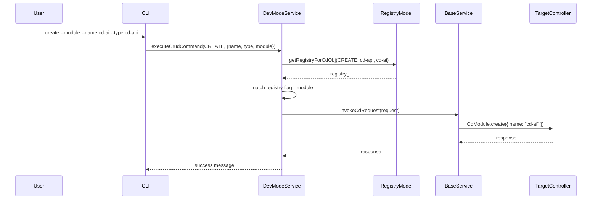

# cd-cli Command Execution Flow: From Syntax to Automation

## Introduction

The `cd-cli` tool is designed not only as a command-line interface for controlling development workflows but also as the foundation for a domain-specific language (DSL) for intelligent software lifecycle management. With minimal yet expressive syntax, `cd-cli` commands enable users to manipulate system entities like modules, apps, environments, or pipelines. This document outlines the architectural flow and design principles of `cd-cli` through the example command:

```bash
> create --module --name cd-ai --type cd-api;
```

---

## Design Principles

### 1. Simplicity in Grammar

The core grammar structure follows:

```bash
<DevModeAction> --<ActonTarget as CdObjType.cdObjTypeName> --name <CdObj> --type < (AppType or ActonTarget 'owner') as CdObjType>
```

This structure is consistent, expressive, and easy to parse, making it compatible with REPL, natural language interfaces, and AI-driven prompts.

### 2. Descriptor-Driven Execution

All command behaviors are described in external `Descriptor` files. This allows:

- Runtime discovery of capabilities
- Easy extension of CLI logic
- Reuse across GUI, scripts, or AI integrations

### 3. Layered Intelligence

Each command execution flows through a structured pipeline:

- **Syntax Interpretation** → **Descriptor Lookup** → **Request Assembly** → **Execution** → **Feedback**

This modular breakdown also means each layer can evolve independently, or be automated.

---

## Command Execution Walkthrough

### Command:

```bash
> create --module --name cd-ai --type cd-api;
```

### Objective:

Create a new module named `cd-ai` of type `cd-api` using structured descriptors.

---

### Step-by-Step Process

#### 1. Action Entry Point: `executeCrudCommand(...)`

```ts
executeCrudCommand(CREATE, { name: 'cd-ai', type: 'cd-api', module: true })
```

Logs:

```
[executeCrudCommand] action=CREATE, name=cd-ai, type=cd-api
```

#### 2. Registry Lookup via `getRegistryForCdObj(...)`

- Constructs the path to the workshop file:

```ts
../../../app/app-craft/workshop/cd-api/workflow/cd-ai-workshop.model.js
```

- Dynamically loads `getItemRegistry()` to fetch valid registry entries:

Logs:

```
[getRegistryForCdObj] action=CREATE, cdObjName=cd-ai, cdObjType=cd-api
[getRegistryForCdObj] Result: { state: true, data: [...], message: "Create registry generated successfully" }
```

#### 3. Registry Matching

The registry is filtered using `flag` options (e.g., `--module`).

```ts
const selectedItem = registry.find((item) => options[item.flag]);
```

Logs:

```
[executeCrudCommand] Matching item: { "name": "module", ... }
```

#### 4. Request Assembly

Based on the registry, a service request is assembled:

```json
{
  "ctx": "app",
  "m": "app-craft",
  "c": "CdModule",
  "a": "create",
  "dat": { "f_vals": [{ "data": null }], "token": "..." },
  "args": { "name": "cd-ai", "type": "cd-api" }
}
```

Logs:

```
[executeCrudCommand] Final request: { ctx: ..., m: ..., c: ..., a: ..., dat: ..., args: ... }
```

#### 5. Execution via `BaseService`:

This generic service forwards the request to the target controller, `CdModule`, for action.

```ts
const response = await b.invokeCdRequest(request);
```

Logs:

```
[executeCrudCommand] Service response: { state: true, message: ... }
```

---

## Grammar & Syntax as a Foundation for Language

The consistent grammar (verb + type + name + kind) forms the backbone of a language-oriented interface:

- Easy to interpret by REPL
- Easy to serialize into structured logs and changelogs
- Enables future language evolution (e.g.,:
  ```bash
  > fork --roadmap core-app --branch refactor-auth
  > promote --module payment --to staging
  ```
- AI Assistants can use descriptors to understand context and provide suggestions

---

## Diagram: CLI Workflow



---

## Transition from Manual to AI-Driven Development

### 🛠 Manual Phase:

- Developer types command with options manually
- Uses static descriptors and human judgement

### ⚙ Assisted Phase:

- CLI provides prompts, suggestions (based on descriptor metadata)
- Can auto-generate docs, changelogs, and scaffold folders

### 🤖 AI-Driven Phase:

- AI interprets developer goals
- Constructs descriptors, updates roadmap, triggers actions
- Observes feedback from execution

This layered approach transforms `cd-cli` into an intelligent interface for development lifecycles.

---

## Conclusion

The `cd-cli` command execution model is built for composability, clarity, and automation. It serves as both an operational interface and a DSL for system evolution. The `create` command shown here represents just one path—yet its design allows future commands to build on this syntax with full semantic traceability.

Combined with descriptors and registry files, this approach transforms development from a manual process to a structured, explainable, and eventually AI-augmentable experience.

---

*Corpdesk – Where commands evolve into language.*

