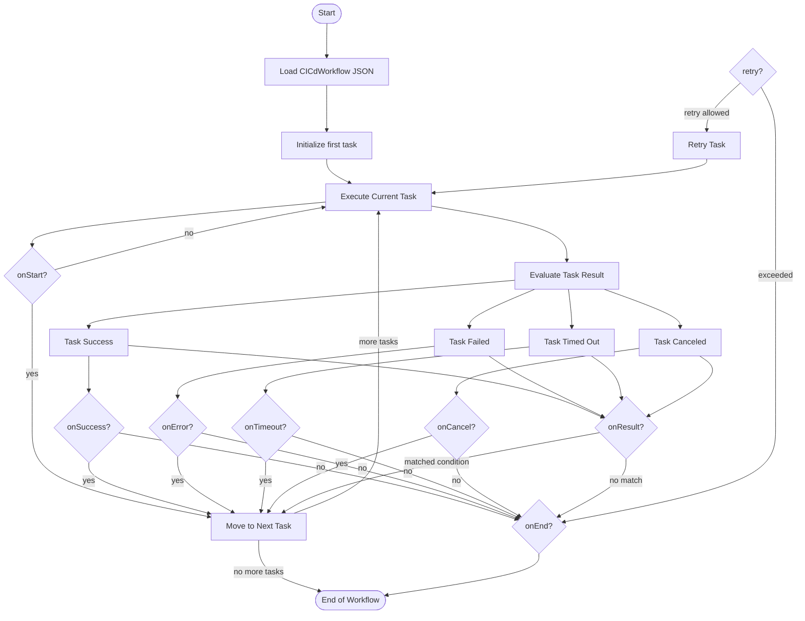
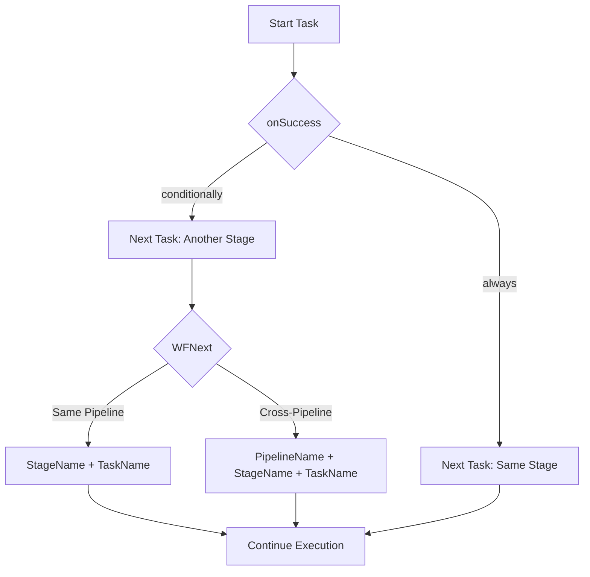
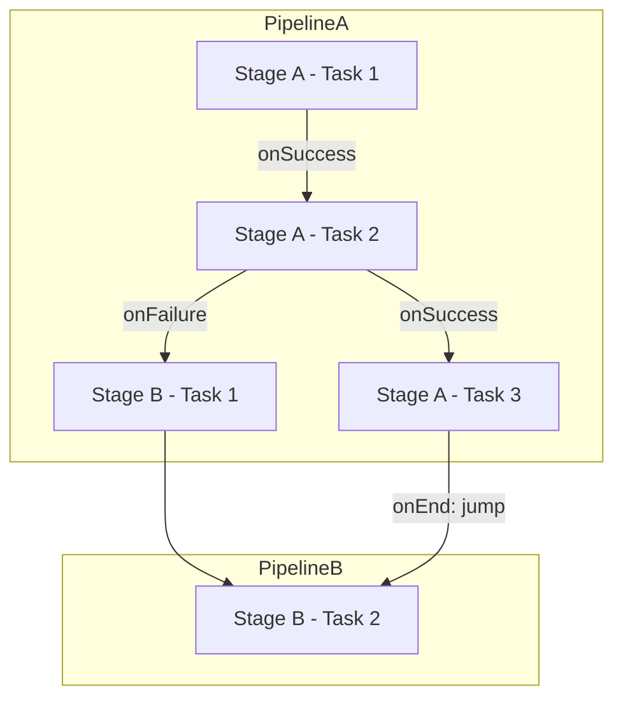

# 📘 CICd Task Execution Engine — Design and Documentation


**Last modifiction date: 2025-06-10; By G. Oremo**

---

## 1. Design Overview

The CICd Task Execution Engine is built to support dynamic, scalable, and maintainable workflows for continuous integration and delivery. The core idea revolves around describing **tasks** using declarative JSON and executing them in a controlled, rule-driven flow that mimics flowcharts or finite state machines.

### 💡 Key Concepts

* **Task-based Execution:** Each task is self-contained, has defined input, execution method, and branching logic based on results.
* **Flow Control Hooks:** Through `onResult`, `onSuccess`, `onError`, etc., task sequences can dynamically evolve based on execution outcome.
* **Retry and Timeout:** Each task can specify its resilience strategies via `retryCount`, `retryDelay`, and `timeout`.
* **Executor Abstraction:** The execution environment (`executor`) abstracts how the task is run: shell script, file, CLI method, or internal request.

---

## 2. Developer Implementation Guide

Developers interact primarily with two parts:

* `CICdTask` interface
* `CICdRunnerService.run()` method (and helpers like `executeTask()`)

### 🔧 `CICdTask` Interface

Each task is defined by:

* Its type:

  * `script-inline`: a string shell command or script to execute.
  * `script-file`: a path to a script file.
  * `method`: a class/method to invoke via the CLI layer.
  * `cdRequest`: a structured request to some service action.

* Flow control keys:

  * `onResult`, `onSuccess`, `onError`, `onTimeout`, etc., all define **conditional transitions** to other task names.

* Execution control:

  * `timeout`: Max allowed execution time.
  * `retryCount`: Max retries if the task fails.
  * `retryDelay`: Milliseconds to wait between retries.

### 🧠 CICdRunnerService::run()

The `run()` method loads a workflow (from `CiCdDescriptor`) and resolves the pipeline. Each task is executed via `executeTask()` and evaluated. The next task is selected using flow control hooks.

The control flow can follow non-linear paths — like DAGs (Directed Acyclic Graphs) or FSMs (Finite State Machines), improving flexibility.

---

## 3. JSON Configuration (User Point of View)

Users configure workflows in JSON using the `CiCdDescriptor` structure. A simplified version could look like this:

```json
{
  "cICdPipeline": {
    "stages": [
      {
        "name": "Build",
        "tasks": [
          {
            "name": "compile-source",
            "type": "script-inline",
            "executor": "local",
            "script": "npm run build",
            "status": "pending",
            "onResult": [
              { "condition": "success", "next": "run-tests" },
              { "condition": "failure", "next": "notify-failure" }
            ],
            "retryCount": 2,
            "retryDelay": 3000
          },
          {
            "name": "run-tests",
            "type": "method",
            "executor": "local",
            "className": "TestService",
            "methodName": "runUnitTests",
            "status": "pending",
            "onSuccess": [
              { "condition": "always", "next": "deploy" }
            ]
          },
          {
            "name": "deploy",
            "type": "cdRequest",
            "executor": "remote",
            "cdRequest": {
              "service": "Deployer",
              "action": "pushToStaging",
              "data": { "branch": "main" }
            },
            "status": "pending"
          },
          {
            "name": "notify-failure",
            "type": "method",
            "executor": "local",
            "className": "NotificationService",
            "methodName": "sendAlert",
            "input": { "message": "Build failed!" },
            "status": "pending"
          }
        ]
      }
    ]
  }
}
```

## Diagram (CI/CD Task Runner Flow)
Below is a Mermaid flowchart diagram that models how CICdRunnerService.run() works using the CICdTask JSON data, reflecting the various control flow options (onStart, onSuccess, onError, onResult, etc.) and showing how the workflow progresses through task states.

## Notes:

    The diagram reflects how each task can have optional handlers like onStart, onResult, onError, etc.

    AI or CLI agents following this flow can determine the next step based on runtime conditions and JSON configuration.

    If you define retry logic (retryCount, retryDelay), it would loop via OnRetry.



## 🤭 Flow Navigation with `WFNext` Interface

In complex CI/CD workflows, it is essential to control how execution moves from one task to another. The `WFNext` interface introduces a **flexible and intuitive addressing scheme** for task navigation that respects the pipeline's hierarchical structure.

### 📀 Hierarchical Structure

A `CICdPipeline` is structured as:

* `Pipeline` → contains one or more `Stages`
* `Stage` → contains one or more `Tasks`
* `Task` → defines actions and their flow transitions


# Workflow Navigation and `WFNext` Interface

## Overview

Workflow navigation within a CI/CD pipeline is controlled through a flexible `next` directive. Traditionally, the `next` field within a `CICdTask` referenced the name of the next task to execute. However, as the structure of pipelines evolved into a three-tier hierarchy — `CICdPipeline` → `CICdStage[]` → `CICdTask[]` — a more powerful and precise referencing model became necessary.

## The `WFNext` Interface

To support targeted transitions and task jumping within or across stages and pipelines, the new `WFNext` interface has been introduced:

```ts
interface WFNext {
  pipelineName?: string; // Optional. If omitted, current pipeline is assumed
  stageName?: string;    // Optional. If omitted, current stage is assumed
  taskName: string;      // Required. Target task to execute next
}
```

This design allows developers to specify as much context as needed:

* **Just `taskName`** → interpreted as task within the same stage.
* **`stageName` + `taskName`** → jump to another stage within the same pipeline.
* **`pipelineName` + `stageName` + `taskName`** → cross-pipeline jump.

### Example Usage in a `CICdTask`:

```ts
onSuccess: [
  {
    condition: 'always',
    next: {
      stageName: 'DeployStage',
      taskName: 'DeployApp'
    }
  }
]
```

### ✅ Optional Shorthand Convention

As a convenience, the `next` directive can also accept a single string in the form of:

```
"stageName/taskName"
```

This shorthand is internally interpreted as:

```ts
next: {
  stageName: "stageName",
  taskName: "taskName"
}
```

If only `"taskName"` is provided, it's interpreted as:

```ts
next: {
  taskName: "taskName"
}
```

This flexibility allows users to define minimal workflows quickly, while still having the power to specify cross-stage or cross-pipeline transitions when necessary.

> ✅ This means both formats below are valid and equivalent when referencing a task in the same stage:
>
> ```json
> "next": "deployApp"
> ```
>
> or
>
> ```json
> "next": { "taskName": "deployApp" }
> ```


#### 🧠 Smart Resolution Rules

To simplify referencing, `WFNext` supports partial addressing and even string shortcuts:

| Input Type                              | Interpretation                       |
| --------------------------------------- | ------------------------------------ |
| `"taskOnly"`                            | Task in current stage and pipeline   |
| `{ taskName }`                          | Same as above                        |
| `{ stageName, taskName }`               | Task in another stage, same pipeline |
| `{ pipelineName, stageName, taskName }` | Task in another pipeline             |

This design enables both concise and explicit definitions.

You can define flow transitions like so:

```ts
onSuccess: [
  {
    condition: 'always',
    next: { stageName: 'Test', taskName: 'runTests' }
  }
],
onFailure: [
  {
    condition: 'always',
    next: 'cleanupEnvironment'
  }
]
```

> You may also define `next` as a `string`, which will be interpreted as a `taskName` within the current stage and pipeline.

### 🔄 Normalization Logic

To work seamlessly at runtime, a helper can normalize `WFNextRef` inputs:

```ts
function normalizeWFNext(next: WFNextRef, context: {
  currentPipeline: string;
  currentStage: string;
}): WFNext {
  if (typeof next === 'string') {
    return {
      pipelineName: context.currentPipeline,
      stageName: context.currentStage,
      taskName: next
    };
  }
  return {
    pipelineName: next.pipelineName ?? context.currentPipeline,
    stageName: next.stageName ?? context.currentStage,
    taskName: next.taskName
  };
}
```


---

## Mermaid Diagram of Navigation Flow




---

### 🌐 Mermaid Diagram – Workflow Transition with `WFNext`



In this diagram:

* Task transitions are conditionally triggered.
* Cross-stage and cross-pipeline jumps are handled using fully qualified `WFNext` references.
* Tasks can still chain linearly within the same stage using string shortcuts.

---

## Benefits of `WFNext`

* ✅ Improves task routing flexibility
* ✅ Enables conditional, stage-aware, and pipeline-aware flow control
* ✅ Makes CI/CD definitions modular and scalable
* ✅ Allows future integration with AI systems for intelligent navigation

---

You can now plug this system into your task execution engine to enable **highly dynamic and resilient CI/CD pipelines**.

---

## 4. Future Considerations for CICd Task Execution Engine

### 🚀 Short-Term

* ✅ Implement `on*` flow resolution using a task map (`Map<string, CICdTask>`) for quick lookups.
* ✅ Add support for execution graphs (DAG) where tasks can fan-out or fan-in.
* ⏳ Introduce conditional input/output expressions and preconditions (`if`-like logic).
* ⏳ Task-level logging and metrics: start/end timestamps, retries used, failure reasons.

### 🧱 Mid-to-Long-Term

* 🔁 Support **loops** and **dynamic task generation** (e.g., loop over environments).
* 💾 Support **persistent state management**, enabling long-running workflows and resumability.
* 🔐 Integrate secrets and credentials management from `cdVault` directly into task execution.
* 🧪 Enable **testing** and **simulation** mode for workflows before production run.
* 🧬 Versioning of workflows to support rollback and historical comparisons.
* 📦 Plugin system for defining custom task types beyond the current 4 (`method`, `cdRequest`, etc.)


