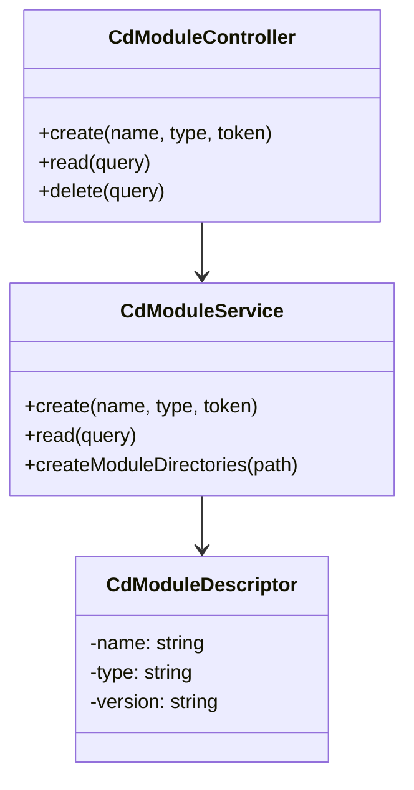

# Corpdesk CLI Documentation

## 1. Mission, Objectives, and Goals

### Mission

To provide a unified, efficient, and scalable command-line interface (CLI) for managing and automating Corpdesk's app and system modules, while ensuring seamless communication with the `cd-api` backend.

### Objectives

* Standardize code structures across the CLI ecosystem.
* Facilitate predictable development through reusable patterns.
* Provide automation hooks to support AI-generated and human-authored development.
* Enable secure and consistent communication with Corpdesk backend services.

### Goals

* Improve developer productivity by enforcing consistent conventions.
* Reduce bugs by leveraging type-safe interfaces and error handling.
* Maximize code reuse through shared service/controller layers.
* Enable future AI-based CLI code generation and testing workflows.

---

## 2. Strategy to Achieve the Mission

1. **Modular Architecture:** Separate concerns into distinct system (`sys`) and application (`app`) areas.
2. **Unified Communication Layer:** Use a single `HttpService` to standardize API requests.
3. **Consistent Data Contracts:** Enforce `ICdRequest`, `ICdResponse`, and `CdFxReturn<T>` to define input/output schemas.
4. **Secure Credential Management:** Use `cd-vault` to store and resolve sensitive data references.
5. **CLI-Oriented Patterns:** Avoid dependency injection or constructor parameters to ease automation and instantiation.
6. **Standard Error Handling:** All functions follow `try/catch` and return `CdFxReturn<T>` for reliability.
7. **Developer Friendly Tooling:** Support scaffold generators and templates for new modules/controllers.

---

## 3. File and Directory Structure & Naming Conventions

### Project Root

```
emp-12@emp-12 ~/cd-cli (main)> tree -L 4 -d
.
├
└── src
    ├── CdCli
    │   ├── app
    │   │   ├── app-craft
    │   │   ├── cd-ai-pwa
    │   │   ├── cd-auto-aws
    │   │   ├── cd-auto-azure
    │   │   ├── cd-auto-do
    │   │   ├── cd-auto-gcp
    │   │   ├── cd-auto-git
    │   │   ├── cd-auto-k8s
    │   │   ├── cd-geo
    │   │   └── coops
    │   └── sys
    │       ├── base
    │       ├── cd-cli
    │       ├── cd-comm
    │       ├── cd-push
    │       ├── cd-scheduler
    │       ├── dev-descriptor
    │       ├── dev-mode
    │       ├── moduleman
    │       ├── user
    │       └── utils
    ├── configs

```

### Module Structure (Example: cd-auto-git)

```
src/CdCli/sys/cd-auto-git/
├── controllers/
│   └── cd-auto-git.controller.ts
├── models/
│   └── cd-auto-git.model.ts
├── services/
│   └── cd-auto-git.service.ts
```

### Naming Conventions

* **Files:** kebab-case (`cd-auto-git.controller.ts`)
* **Classes:** PascalCase (`CdAutoGitController`)
* **Instance Variables:**

  * Controllers: `ctl<ClassName>` (e.g., `ctlUser`)
  * Services: `sv<ClassName>` (e.g., `svUser`)

---

## 4. Coding Standards

### Interfaces and Communication
Idealy, all functions should return predictable datatype: CdFxReturn.
This can be backed up by presetn constants eg: CD_FX_FAIL

```ts
export interface CdFxReturn<T> {
  data: T | null;
  state: boolean;
  message?: string;
}

export const CD_FX_FAIL = {
  data: null,
  state: false,
  message: 'Failed!'
};
```

### HTTP Communication
cd-cli relies on cd-api. The communication between cd-cli and cd-api is via json payload via http.

* Use only `HttpService` for backend calls:

```ts
import { HttpService } from '../../base/http.service';
```

* Backend request and response must conform to `ICdRequest` and `ICdResponse`

### Error Handling

* All methods must use `try/catch`
* Always return `CdFxReturn<T>` to prevent fatal runtime errors

### Controller Initialization

* No constructor arguments/injection:
This is to allow easy mechanism for automation.
Note: Even though this is by intention, this ideal situation has not be complied with 100%.

```ts
const ctlUser = new UserController();
```

- No dependency injection (to avoid circular dependencies and automation complexity)
- This is also to allow easy logics for automation in code generation.


### Secrets and Profiles

* Resolve secrets via `cd-vault`
* Profiles loaded from configuration file, matched via `config.cdApiLocal`

### Debugging and Logging

* Use `CdLog.debug/info/error` for logging
* Set log level via `CdLog.setDebugLevel(level)`

---

This document forms the baseline for CLI operations, enhancements, and automation in the Corpdesk ecosystem. It ensures maintainability, reliability, and adaptability as we evolve the system further.


---

# Introducing the Corpdesk Module Architecture

## Overview

Corpdesk modules in `cd-cli` follow a clean, standardized architecture that organizes automation logic into three essential directories:

```
📦 <corpdesk-module>
├── controllers/   // Handles logic exposed to other modules or CLI
├── services/      // Handles processing and utility logic
├── models/        // Defines data structures, types, and descriptors
```

This modular breakdown not only enforces separation of concerns but also lays the foundation for scalable automation, terminal-driven workflows, and AI-assisted development.

In this guide, we explore these principles using the `app-craft` module as our base example.

---

## 1. Controller Layer — Entry Point for CLI and AI

The `CdModuleController` acts as the bridge between developer instructions (via `cd-cli`) and backend services. It's the central executor of module-oriented commands like `create`, `read`, `update`, and `delete`.

### Sample Controller: `cd-module.controller.ts`

```ts
export class CdModuleController {
  svCdModule: CdModuleService;
  constructor() {
    this.svCdModule = new CdModuleService();
    this.svCdModule.init();
  }

  async create(moduleName: string, moduleType: string, cdToken: string): Promise<CdFxReturn<null>> {
    return this.svCdModule.create(moduleName, moduleType, cdToken);
  }

  async read(q?: IQuery): Promise<CdFxReturn<CdModuleDescriptor[] | null>> {
    return this.svCdModule.read(q);
  }
  // ... other methods ...
}
```

---

## 2. Service Layer — Intelligent Behavior Processing

Services implement the core business logic and automation behavior. They are internal to the module and invoked only by controllers.

### Fictitious Service Class: `cd-module.service.ts`

```ts
export class CdModuleService {
  async init(): Promise<void> {
    // Create required scaffolding or config for modules
  }

  async create(moduleName: string, moduleType: string, cdToken: string): Promise<CdFxReturn<null>> {
    // Step 1: Scaffold directory
    await this.createModuleDirectories(`./src/CdCli/app/${moduleName}`);

    // Step 2: Write initial model.json, controller.ts, service.ts
    // ... logic ...

    return { state: true, data: null, message: `Module ${moduleName} created.` };
  }

  async read(q: IQuery): Promise<CdFxReturn<CdModuleDescriptor[]>> {
    // Query registered module.json files
  }

  async createModuleDirectories(path: string): Promise<CdFxReturn<null>> {
    // Create controllers/, models/, services/ folders
  }
}
```

---

## 3. Model Layer — Structured Knowledge and Descriptors

Models represent metadata about the modules and the CLI instructions they expose.

### Sample Model: `cd-module-descriptor.model.ts`

```ts
export interface CdModuleDescriptor {
  name: string;
  type: string;
  version: string;
  createdAt: Date;
  description?: string;
}
```

These descriptors can be stored in JSON files or exported as part of `.model.ts` files for automated lookups.

---

## 4. Class Diagram (Simplified)



---

## 5. Terminal to AI Evolution

### Phase 1: Manual Commands

```bash
> create --module --name cd-ai --type cd-api;
```

### Phase 2: CLI-Assisted Development

- Intelligent prompt suggestions
- Auto-filled `--type` and `--name` options from registry
- Logging and documentation automation

### Phase 3: AI-Driven Development

- AI reads goals from roadmap and executes commands
- Suggests descriptors, changelogs, and doc updates
- Learns from usage patterns to improve development flow

---

## 6. Key Takeaway

> A Corpdesk module is not just a code unit—it’s a self-descriptive, extensible, automatable development entity.

By structuring every module using the controller-service-model triad, `cd-cli` makes it possible to:

- Scaffold modules quickly
- Synchronize with Git or remote repos
- Transition from static coding to AI-guided workflows

---

## 7. Controller Scaffolding Guide

To simplify automation, controllers follow predictable naming and structure patterns.

### Standard Pattern

```ts
// src/CdCli/app/app-craft/controllers/<cdObjTypeName(SnakeCase)>.controller.ts
export class <cdObjTypeName(PascalCase)>Controller {
  sv<cdObjTypeName(PascalCase)>: <cdObjTypeName(PascalCase)>Service;
  constructor() {
    this.sv<cdObjTypeName(PascalCase)> = new <cdObjTypeName(PascalCase)>Service();
    this.sv<cdObjTypeName(PascalCase)>.init();
  }

  async <DevModeActionBasedMethod>() : Promise<CdFxReturn<null>> {
    // Delegates to service
  }
}
```

### Example Controller for `App`

```ts
export class AppController {
  svApp: AppService;
  constructor() {
    this.svApp = new AppService();
    this.svApp.init();
  }

  async upgrade(appName: string, appType: string, cdToken: string): Promise<CdFxReturn<null>> {
    return this.svApp.upgrade(appName, appType, cdToken);
  }
}
```

This convention makes it easy to:

- Auto-discover controllers
- Generate or modify them via `cd-cli`
- Ensure uniformity across module components

---

