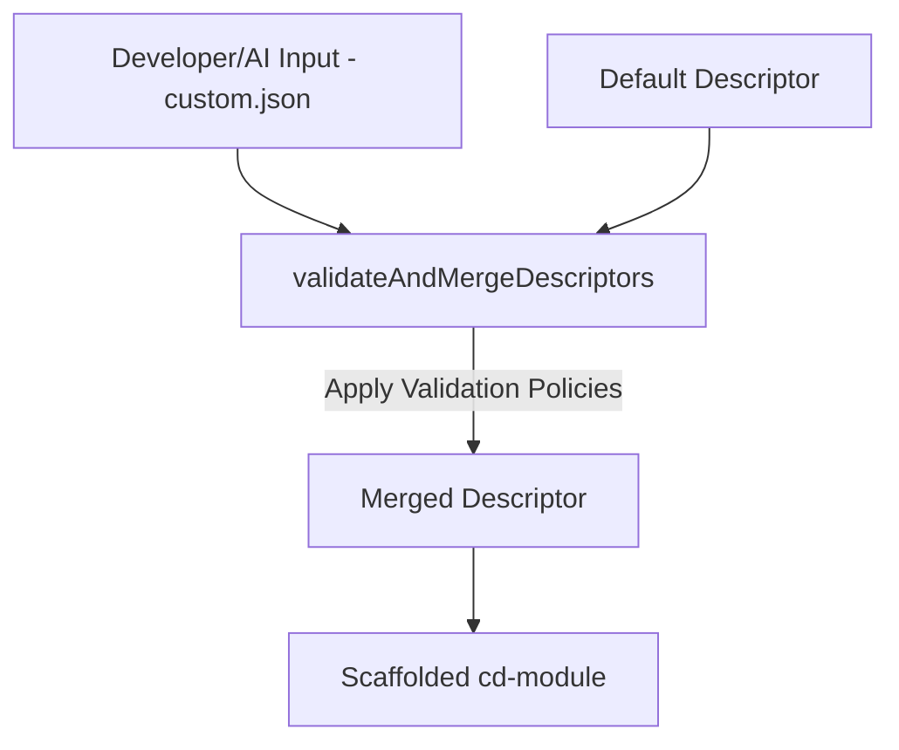
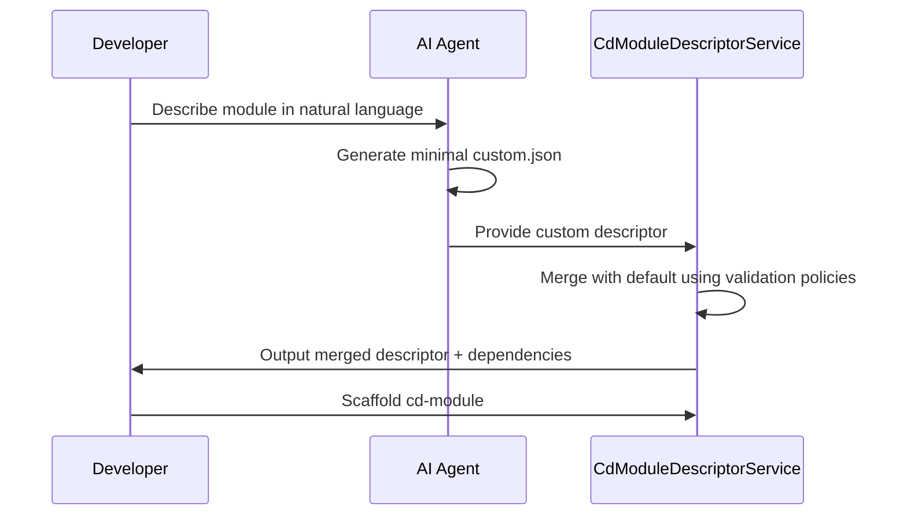

# RFC-0004: Descriptor Merging with Validation Policies

## Title

**Validation Policy Pipeline for CdModuleDescriptor Assembly**

## Status

Draft

## Context

In Corpdesk, scaffolding a `cd-module` requires assembling a **module descriptor** that defines controllers, services, models, dependencies, and metadata. To minimize developer effort and verbosity, this descriptor is derived from two sources:

1. **Default descriptor** – provided by the system with all required boilerplate.
2. **Custom descriptor** – provided by a developer or AI agent as a minimal JSON file.

Merging these descriptors requires a **policy-driven validation process** to ensure correctness, enforce conventions, and allow custom descriptors to override defaults when appropriate.

This innovation represents a **human–machine integration breakthrough**: humans (developers) provide intent minimally, while AI agents augment, validate, and assemble fully usable module descriptors.

---

## The Merging Process

1. **Custom descriptor creation**

   * Human or AI agent prepares a minimal JSON descriptor.
2. **Default descriptor derivation**

   * System generates a default descriptor with all standard boilerplate.
3. **Validation policy pipeline**

   * Policies are applied to check correctness, enforce rules, and decide on overrides.
4. **Merged descriptor output**

   * Produces a ready-to-use descriptor for scaffolding.

---

## Example

### Custom Descriptor (from developer)

```ts
{
  ctx: 'app',
  name: 'cd-ai',
  parentAppType: 'cd-api',
  appType: 'cd-module',
  cdModuleType: { typeName: 'cd-api' },
  description: 'module for processing ai auto development of corpdesk module at the backend',
  controllers: [
    {
      name: 'cd-ai',
      type: 'controller',
      methods: [ [Object], [Object], [Object] ]
    },
    {
      name: 'cd-ai-usage-logs',
      type: 'controller',
      methods: [ [Object], [Object] ]
    }
  ],
  services: [
    {
      name: 'cd-ai',
      type: 'service',
      methods: [ [Object], [Object], [Object] ]
    },
    {
      name: 'cd-ai-usage-logs',
      type: 'service',
      methods: [ [Object], [Object] ]
    }
  ],
  models: [
    { name: 'cd-ai', fields: [] },
    { name: 'cd-ai-usage-logs', fields: [] }
  ],
  projectGuid: 'd284f4bf-7d5a-4eb0-839d-63dc48d5874b',
  versionControl: {
    name: 'CdAi',
    repository: {
      name: 'cd-ai',
      url: 'https://github.com/corpdesk/cd-ai.git',
      type: 'git',
      enabled: true,
      isPrivate: false,
      credentials: { repoHost: 'corpdesk' },
      directories: [ [Object], [Object], [Object], [Object], [Object], [Object] ]
    }
  },
  contributors: {
    vendor: { name: 'emp services ltd' },
    developers: [ { name: 'g.oremo', contact: 'george.oremo@gmail.com' } ]
  }
}
```

### Default Descriptor (simplified)

```ts
{
  ctx: 'app',
  name: 'cd-ai',
  parentAppType: 'cd-api',
  appType: 'cd-module',
  cdModuleType: { typeName: 'cd-api' },
  description: 'module for processing ai auto development of corpdesk module at the backend',
  controllers: [
    {
      type: 'controller',
      name: 'cd-ai',
      classSignature: { extends: 'CdController' },
      attributes: [ [Object], [Object], [Object] ],
      methods: [ [Object], [Object], [Object], [Object], [Object], [Object] ]
    },
    {
      type: 'controller',
      name: 'cd-ai-usage-logs',
      classSignature: { extends: 'CdController' },
      attributes: [ [Object], [Object], [Object] ],
      methods: [ [Object], [Object], [Object], [Object], [Object], [Object] ]
    }
  ],
  services: [
    {
      type: 'service',
      name: 'cd-ai',
      classSignature: { extends: 'CdService', implements: [] },
      attributes: [
        [Object], [Object],
        [Object], [Object],
        [Object], [Object],
        [Object], [Object]
      ],
      methods: [
        [Object], [Object],
        [Object], [Object],
        [Object], [Object],
        [Object], [Object],
        [Object], [Object],
        [Object]
      ]
    },
    {
      type: 'service',
      name: 'cd-ai-usage-logs',
      classSignature: { extends: 'CdService', implements: [] },
      attributes: [
        [Object], [Object],
        [Object], [Object],
        [Object], [Object],
        [Object], [Object]
      ],
      methods: [
        [Object], [Object],
        [Object], [Object],
        [Object], [Object],
        [Object], [Object],
        [Object], [Object],
        [Object]
      ]
    }
  ],
  models: [
    {
      name: 'CdAi',
      parentController: 'cd-ai',
      fileName: 'cd-ai.model.ts',
      tableName: 'cd_ai',
      fields: [ [Object], [Object], [Object], [Object], [Object], [Object] ]
    },
    {
      name: 'CdAiUsageLogs',
      parentController: 'cd-ai-usage-logs',
      fileName: 'cd-ai-usage-logs.model.ts',
      tableName: 'cd_ai_usage_logs',
      fields: [ [Object], [Object], [Object], [Object], [Object], [Object] ]
    }
  ],
  projectGuid: 'd284f4bf-7d5a-4eb0-839d-63dc48d5874b',
  versionControl: {
    name: 'CdAi',
    repository: {
      name: 'cd-ai',
      url: 'https://github.com/corpdesk/cd-ai.git',
      type: 'git',
      enabled: true,
      isPrivate: false,
      credentials: { repoHost: 'corpdesk' },
      directories: [ [Object], [Object], [Object], [Object], [Object], [Object] ]
    }
  },
  contributors: {
    vendor: { name: 'emp services ltd' },
    developers: [ { name: 'g.oremo', contact: 'george.oremo@gmail.com' } ]
  }
}
```

### Merged Descriptor (after validation)

```ts
{
  ctx: 'app',
  name: 'cd-ai',
  parentAppType: 'cd-api',
  appType: 'cd-module',
  cdModuleType: { typeName: 'cd-api' },
  description: 'module for processing ai auto development of corpdesk module at the backend',
  controllers: [
    {
      type: 'controller',
      name: 'cd-aiController',
      classSignature: { extends: 'CdController' },
      attributes: [ [Object], [Object], [Object] ],
      methods: [ [Object], [Object], [Object] ]
    },
    {
      type: 'controller',
      name: 'cd-ai-usage-logsController',
      classSignature: { extends: 'CdController' },
      attributes: [ [Object], [Object], [Object] ],
      methods: [ [Object], [Object] ]
    }
  ],
  services: [
    {
      type: 'service',
      name: 'cd-aiService',
      classSignature: { extends: 'CdService', implements: [] },
      attributes: [
        [Object], [Object],
        [Object], [Object],
        [Object], [Object],
        [Object], [Object]
      ],
      methods: [ [Object], [Object], [Object] ]
    },
    {
      type: 'service',
      name: 'cd-ai-usage-logsService',
      classSignature: { extends: 'CdService', implements: [] },
      attributes: [
        [Object], [Object],
        [Object], [Object],
        [Object], [Object],
        [Object], [Object]
      ],
      methods: [ [Object], [Object] ]
    }
  ],
  models: [
    {
      name: 'CdAiModel',
      parentController: 'cd-ai',
      fileName: 'cd-ai.model.ts',
      tableName: 'cd_ai',
      fields: [ [Object], [Object], [Object], [Object], [Object], [Object] ],
      type: 'model'
    },
    {
      name: 'CdAiUsageLogsModel',
      parentController: 'cd-ai-usage-logs',
      fileName: 'cd-ai-usage-logs.model.ts',
      tableName: 'cd_ai_usage_logs',
      fields: [ [Object], [Object], [Object], [Object], [Object], [Object] ],
      type: 'model'
    },
    { name: 'cd-aiModel', fields: [], type: 'model' },
    { name: 'cd-ai-usage-logsModel', fields: [], type: 'model' }
  ],
  projectGuid: 'd284f4bf-7d5a-4eb0-839d-63dc48d5874b',
  versionControl: {
    name: 'CdAi',
    repository: {
      name: 'cd-ai',
      url: 'https://github.com/corpdesk/cd-ai.git',
      type: 'git',
      enabled: true,
      isPrivate: false,
      credentials: { repoHost: 'corpdesk' },
      directories: [ [Object], [Object], [Object], [Object], [Object], [Object] ]
    }
  },
  contributors: {
    vendor: { name: 'emp services ltd' },
    developers: [ { name: 'g.oremo', contact: 'george.oremo@gmail.com' } ]
  }
}
```

### Sanitized Descriptor (post merging validation)

```ts
{
  ctx: 'app',
  name: 'cd-ai',
  parentAppType: 'cd-api',
  appType: 'cd-module',
  cdModuleType: { typeName: 'cd-api' },
  description: 'module for processing ai auto development of corpdesk module at the backend',
  controllers: [
    {
      type: 'controller',
      name: 'cd-ai-controller',
      classSignature: { extends: 'CdController' },
      attributes: [ [Object], [Object], [Object] ],
      methods: [ [Object], [Object], [Object] ],
      fileName: 'cd-ai-controller'
    },
    {
      type: 'controller',
      name: 'cd-ai-usage-logs-controller',
      classSignature: { extends: 'CdController' },
      attributes: [ [Object], [Object], [Object] ],
      methods: [ [Object], [Object] ],
      fileName: 'cd-ai-usage-logs-controller'
    }
  ],
  services: [
    {
      type: 'service',
      name: 'cd-ai-service',
      classSignature: { extends: 'CdService', implements: [] },
      attributes: [
        [Object], [Object],
        [Object], [Object],
        [Object], [Object],
        [Object], [Object]
      ],
      methods: [ [Object], [Object], [Object] ],
      fileName: 'cd-ai-service'
    },
    {
      type: 'service',
      name: 'cd-ai-usage-logs-service',
      classSignature: { extends: 'CdService', implements: [] },
      attributes: [
        [Object], [Object],
        [Object], [Object],
        [Object], [Object],
        [Object], [Object]
      ],
      methods: [ [Object], [Object] ],
      fileName: 'cd-ai-usage-logs-service'
    }
  ],
  models: [
    {
      name: 'cd-ai-model',
      parentController: 'cd-ai',
      fileName: 'cd-ai-model',
      tableName: 'cd_ai',
      fields: [ [Object], [Object], [Object], [Object], [Object], [Object] ],
      type: 'model'
    },
    {
      name: 'cd-ai-usage-logs-model',
      parentController: 'cd-ai-usage-logs',
      fileName: 'cd-ai-usage-logs-model',
      tableName: 'cd_ai_usage_logs',
      fields: [ [Object], [Object], [Object], [Object], [Object], [Object] ],
      type: 'model'
    }
  ],
  projectGuid: 'd284f4bf-7d5a-4eb0-839d-63dc48d5874b',
  versionControl: {
    name: 'CdAi',
    repository: {
      name: 'cd-ai',
      url: 'https://github.com/corpdesk/cd-ai.git',
      type: 'git',
      enabled: true,
      isPrivate: false,
      credentials: { repoHost: 'corpdesk' },
      directories: [ [Object], [Object], [Object], [Object], [Object], [Object] ]
    }
  },
  contributors: {
    vendor: { name: 'emp services ltd' },
    developers: [ { name: 'g.oremo', contact: 'george.oremo@gmail.com' } ]
  }
}
```

Here, the **custom descriptor overrides the default** because of the override policy.

---

## Validation Policies

Validation policies are modular, composable rules applied during the merge. Each policy has a focused responsibility.

### Examples

* **`validationPolicyOverrideDuplicates`** – if user duplicates a controller/service, the custom one overrides the default.
* **`validationPolicyNamingConventions`** – enforce casing rules (PascalCase for class names, kebab-case for filenames).
* **`validationPolicyVersionResolution`** – ensure correct version control metadata.
* **`validationPolicyDependencyResolution`** – validate and enrich declared dependencies.
* **`validationPolicySecurityCheck`** – ensure no insecure or disallowed descriptors are scaffolded.

---

## DependencyDescriptors

At this stage, **dependencies** can also be assembled. These may be:

* Explicitly declared by the developer.
* Inferred by the AI agent from natural language input.

**Example:**

> *"The module should fetch data from an external API and log the response."*

AI infers:

```json
{
  "dependencies": [
    { "name": "HttpClient", "version": "latest" },
    { "name": "Logger", "version": "1.0.0" }
  ]
}
```

---

## Mermaid Diagram: Descriptor Merging Pipeline



---

## Mermaid Diagram: Human–Machine Integration



---

## Innovation and Relevance

This system is more than a technical pipeline — it is a **new paradigm in development**:

* **For Developers (Humans):**

  * Reduced cognitive load.
  * No need to write verbose descriptors.
  * Focus remains on business logic and domain knowledge.

* **For AI Agents (Machines):**

  * Act as intelligent assistants that understand natural language.
  * Generate boilerplate descriptors.
  * Infer dependencies and enforce validation policies.

* **For the Future:**

  * Policies can evolve with system needs (security, compliance, scalability).
  * Human–machine collaboration ensures speed, accuracy, and adaptability.

This **policy-driven merging system** embodies Corpdesk’s commitment to **innovation in human–machine integration**, shaping how modules are developed now and in the future.
