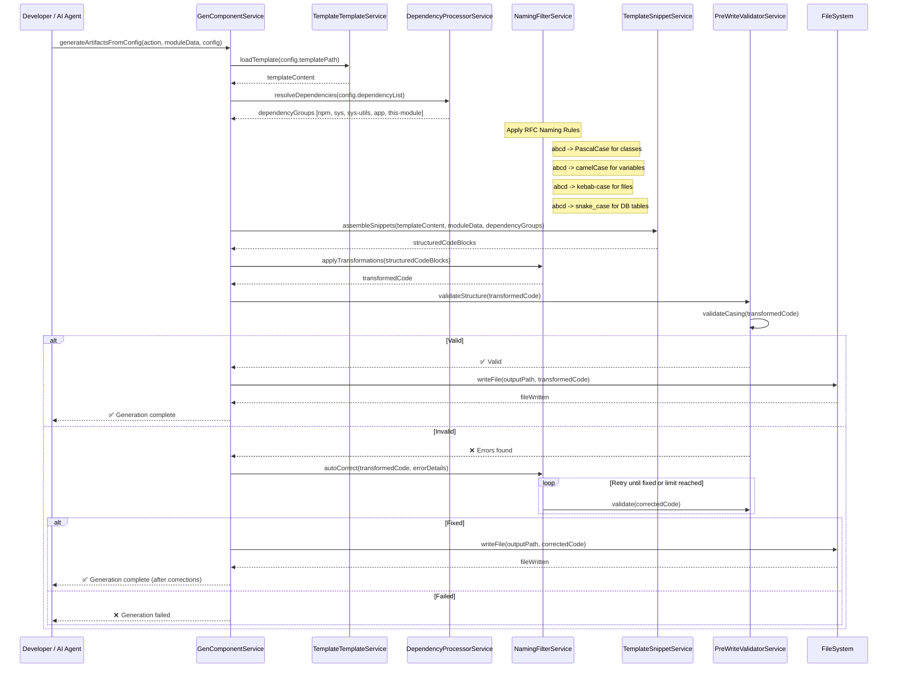

# 📄 RFC-0002 – Corpdesk Scaffold & Automation Guide

## Title: Corpdesk Component Scaffolding and Generation
Version: 1.1 (2025-08-21)
Supersedes: Version 1.0 (2024-05-12)
Status: Active
Authors: Corpdesk Core Team
Applies to: cd-cli, moduleman, corpdesk framework

## 1. Purpose

This RFC defines how Corpdesk components (controllers, services, models, utilities, plugins, etc.) are scaffolded and generated.

Originally (v1.0), generation was template-driven: each component was scaffolded from a static .template.ts file with placeholder substitution. While simple, this approach created rigidity and manual maintenance burdens whenever naming conventions or dependency rules evolved.

As of v1.1, the primary driver is now descriptors + RFC rules, with templates downgraded to optional stubs for areas that cannot be inferred automatically. This shift aligns with the long-term automation policy defined in RFC-0001 (Descriptors) and RFC-0005 (Imports & Dependency Automation).

## 2. Versioning Notes

### v1.1 (2025-08-21)

Primary mechanism: Descriptors + RFC rules (RFC-0001 for structure, RFC-0005 for imports).

Templates: Optional; used only as minimal stubs for boilerplate sections (e.g., class body placeholders).

Automation policy: RFCs are the single source of truth. Templates cannot override RFC rules, only extend them where inference is insufficient.

Backward compatibility: Legacy templates are still supported. Migration is recommended.

### v1.0 (2024-05-12)

Primary mechanism: Templates with substitution (__NAME__, __TYPE__, etc.).

Imports and dependencies: Mostly hardcoded in templates.

Policy: Templates were mandatory; descriptors were secondary.

## 3. Guiding Principles

RFC Reference:

All automation **MUST** comply with \[RFC-0001 – Corpdesk Code Standards]. RFC-0002 describes the *process* to implement those rules in generated artifacts.

Descriptor-first

All component properties (type, name, suffix, file path, dependencies) are derived from CdModuleDescriptor.

RFCs (e.g., RFC-0001) define canonical rules.

Template-optional

Templates serve as stub markers only.

Example: controller.template.ts may provide a skeleton method signature, but class name, file name, and imports are descriptor-driven.

Automation policy

Rules for file naming, imports, suffixes, and dependency injection must be enforced programmatically.

Humans should never manually align templates with rules.

Versioning discipline

Every revision of this RFC must explicitly state what changed in automation policy.

Version notes must include rationale.

## 4. Descriptors Reference and Compliance

### 4.1 `CdModuleDescriptor`

Contains metadata about the target module:

* Name, type, and context (`sys` or `app` via `CdCtx`)
* Controllers, services, models, utilities
* Version control directories (for locating templates, workshop, sandbox)

### 4.2 `DependencyDescriptor[]`

Defines all dependencies of a generated file:

* Category: npm, sys, sys-utils, app, this-module
* `cdCtx`: sys/app context for Corpdesk modules
* `targetApp`: cd-api, cd-cli, etc.
* `location`: relative path from repo root
* `resolution`: path + import method
* `usage`: functions, classes, or modules used

Input CdModuleDescriptor is sanitized (RFC-0001 rules).

Duplicate components (same name:type) are removed.

Dependencies are classified using the **import resolution algorithm** in section 5.

## 5. Class Construction Rules

Generated files **MUST** follow this hierarchy:

1. **Imports** (grouped and ordered: npm → sys-core → sys-utils → sys-modules → app-modules → this-module)
2. **Attributes**
3. **Constructor**
4. **Methods** (ordered by visibility: public → protected → private)

### Stage 2: Casing Validation

* PascalCase for classes
* camelCase for variables and methods
* kebab-case for file paths
* snake\_case for DB identifiers

## 9. Version Control Integration

Version control directories in `CdModuleDescriptor.versionControl.repository.directories` **MUST** be used to:

* Locate templates
* Write output to workshop/test-bed/sandbox directories
* Commit changes to correct repo branch

## 5. Automation process
### 5.1 Custom Descriptor input: The system allows users and machine to inser
### 5.2 Persistant Default Data
### 5.3 Merged Data:The initial stage of preparing data to process for scafolding is merging (i) and (ii)
### 5.4 Preflight preperation: Validation and Enrichment of data via configurable plugins called policyValidators

## 6. Validation and Enrichment

If validation fails:

1. Identify violations
2. Auto-correct using RFC-0001 rules
3. Re-validate
4. Retry until fixed or max retries reached

## 7. Import Resolution
7.1 **npm dependency**

   * No `.` or `/` prefix in import path
   * Category = `library`, Source = `npm`, Scope = `module`
   * Resolution = `import` from package name
7.2 **sys module**

   * Path starts with `../../../sys/`
   * `cdCtx = sys`
   * Resolution path = kebab-case file path without `.js`

7.3 **sys utility**

   * Path contains `/utils/`
   * Category = `utility`, cdCtx = `sys`

7.4. **app module**

   * Path starts with `../../<module-name>/`
   * `cdCtx = app`

7.5. **this-module**

   * Path starts with `../models`, `../services`, `../controllers`
   * `cdCtx` = same as target module

7.6. **base special case**

   * Path contains `/base/`
   * Category = `core`, cdCtx = `sys`

### Step 8: Counterparts & Suffixes

Counterparts (e.g., controller ⇔ controller-type) are auto-generated.

Suffix rules are applied consistently.

### Step 9: File Name Setting

Filenames are generated via rules (e.g., user.controller.ts, user.service.ts).

No filename is sourced from templates.

### Step 4: Imports Automation 

2. Guiding Principles

Deterministic Imports

Imports must be derived entirely from component descriptors.

No manual imports are allowed inside templates.

Consistency Across Components

File-to-class imports must follow standardized suffix rules.

Aliasing and relative paths must be consistent within a module.

Minimal Human Burden

Developers should never manually write boilerplate imports for generated components.

If additional imports are required, they must be surfaced through the descriptor definition.

Version Control Alignment

Import resolution rules are versioned via RFCs.

This ensures forward and backward compatibility when rules evolve.

## 10. Generation Workflow

### Step 5: Optional Template Stub

If a template exists (e.g., controller.template.ts), it may inject minimal boilerplate inside the generated file.

Example: default constructor, example method, or JSDoc header.

These must never conflict with RFC-driven imports, naming, or structure.

## 5. Migration Strategy

Short term: Templates remain supported for backward compatibility.

Medium term: New modules must use descriptor-driven scaffolding.

Long term: Templates may be fully deprecated, replaced by inline boilerplate rules in RFCs.

## 6. References

RFC-0001: Descriptors & Standardization

RFC-0005: Imports & Dependency Automation

RFC-0003: Module Initialization Strategy (pending)

