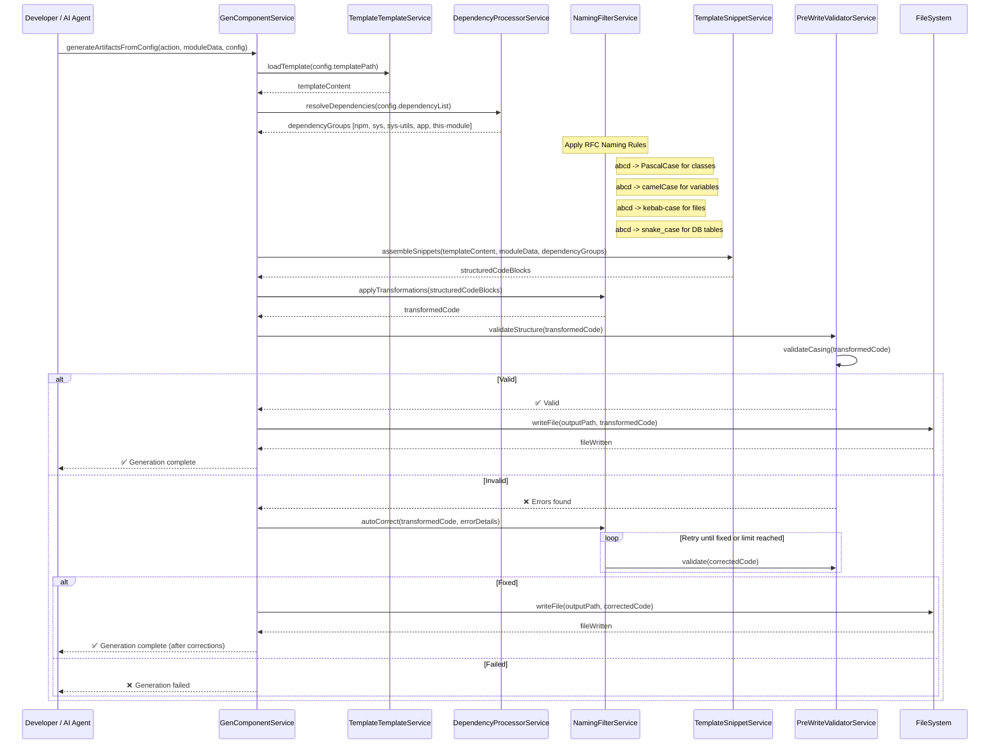

# RFC-0002 – Corpdesk Scaffold & Automation Guide

## 1. Purpose

Defines how Corpdesk code generation tools (e.g., `cd-cli`) apply **RFC-0001** rules in automated scaffolding. Ensures generated code is consistent, predictable, and compliant with Corpdesk standards.

## 2. RFC Reference

All automation **MUST** comply with \[RFC-0001 – Corpdesk Code Standards]. RFC-0002 describes the *process* to implement those rules in generated artifacts.

## 3. Template Usage

Templates are **reference blueprints**, not direct text replacements. Placeholders such as `Abcd` (PascalCase) and `abcd` (camelCase) **MUST** be transformed according to context using RFC-0001 naming conventions.

### Placeholder Transformations:

| Placeholder  | Rule        | Example           |
| ------------ | ----------- | ----------------- |
| `Abcd`       | PascalCase  | `UserService`     |
| `abcd`       | camelCase   | `userService`     |
| `abcd-kebab` | kebab-case  | `user-service.ts` |
| `abcd_snake` | snake\_case | `user_service`    |

## 4. Descriptor Usage

### 4.1 `CdModuleDescriptor`

Contains metadata about the target module:

* Name, type, and context (`sys` or `app` via `CdCtx`)
* Controllers, services, models, utilities
* Version control directories (for locating templates, workshop, sandbox)

### 4.2 `DependencyDescriptor[]`

Defines all dependencies of a generated file:

* Category: npm, sys, sys-utils, app, this-module
* `cdCtx`: sys/app context for Corpdesk modules
* `targetApp`: cd-api, cd-cli, etc.
* `location`: relative path from repo root
* `resolution`: path + import method
* `usage`: functions, classes, or modules used

Dependencies are classified using the **import resolution algorithm** in section 5.

## 5. Import Resolution Algorithm

1. **npm dependency**

   * No `.` or `/` prefix in import path
   * Category = `library`, Source = `npm`, Scope = `module`
   * Resolution = `import` from package name

2. **sys module**

   * Path starts with `../../../sys/`
   * `cdCtx = sys`
   * Resolution path = kebab-case file path without `.js`

3. **sys utility**

   * Path contains `/utils/`
   * Category = `utility`, cdCtx = `sys`

4. **app module**

   * Path starts with `../../<module-name>/`
   * `cdCtx = app`

5. **this-module**

   * Path starts with `../models`, `../services`, `../controllers`
   * `cdCtx` = same as target module

6. **base special case**

   * Path contains `/base/`
   * Category = `core`, cdCtx = `sys`

## 6. Class Construction Rules

Generated files **MUST** follow this hierarchy:

1. **Imports** (grouped and ordered: npm → sys-core → sys-utils → sys-modules → app-modules → this-module)
2. **Attributes**
3. **Constructor**
4. **Methods** (ordered by visibility: public → protected → private)

## 7. Code Validation

### Stage 1: Structure Validation

* Import groups ordered correctly
* Class declaration present
* File naming matches RFC-0001 rules

### Stage 2: Casing Validation

* PascalCase for classes
* camelCase for variables and methods
* kebab-case for file paths
* snake\_case for DB identifiers

## 8. Correction Loop

If validation fails:

1. Identify violations
2. Auto-correct using RFC-0001 rules
3. Re-validate
4. Retry until fixed or max retries reached

## 9. Version Control Integration

Version control directories in `CdModuleDescriptor.versionControl.repository.directories` **MUST** be used to:

* Locate templates
* Write output to workshop/test-bed/sandbox directories
* Commit changes to correct repo branch

## 10. Generation Workflow

### Document Version: RFC-0002
Status: Draft
Last Edited: August 13, 2025
Author: George Oremo
Use Case: Scafolding Guide, Standardization, Patent Support

