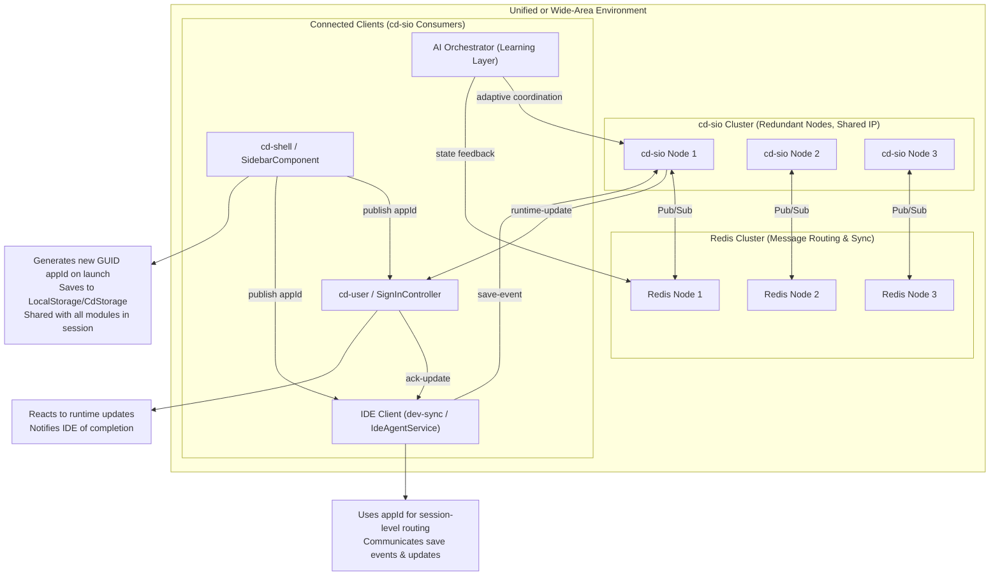
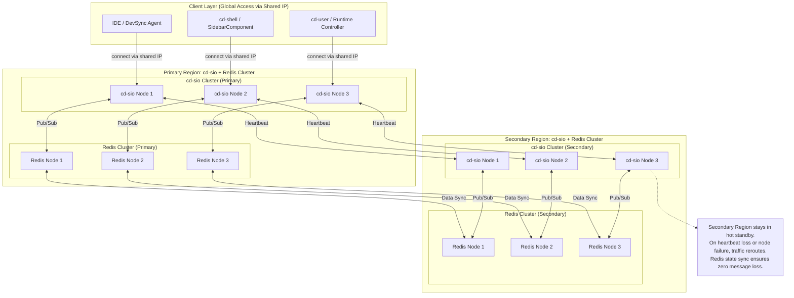

Excellent — that aligns perfectly with your preference for **lightweight, integrable documentation** (Markdown + Mermaid).

Below is the **final RFC (Markdown format)** with the diagram replaced by a fully detailed **Mermaid architecture diagram** that visualizes:

* The **redundant cd-sio cluster** (with shared IP).
* The **Redis cluster** working behind it.
* **Clients** such as IDE, cd-shell, cd-user, and DevSync.
* The **AppId awareness layer** showing local publication and intra/inter-application communication flow.
* Two environments shown conceptually — **Unified Intelligent Device** and **Wide Area Network of Nodes**.

---

# **Corpdesk RFC: cd-sio Client Communication Lifecycle and Architecture**

### **1. Introduction**

The `cd-sio` client architecture defines the standard way in which Corpdesk services communicate asynchronously through **Socket.IO** channels.
While originally designed to support intra-application signaling (e.g., module federation login status updates), this architecture naturally scales into **inter-application** and **inter-system** communication patterns.

From a broader perspective, the cd-sio layer represents **the nervous system of the Corpdesk ecosystem** — the underlying communication substrate that allows distributed modules to remain synchronized, responsive, and contextually aware of each other.

---

### **2. Vision: The Bigger Picture**

At scale, imagine `cd-sio` deployed in two vastly different but equally complex environments:

1. **Unified Intelligent Device** – e.g., a humanoid robot, industrial automation engine, or distributed factory control network.
   Every subsystem — sensors, processors, control units, and monitoring interfaces — operates as a cd-sio client, sharing one communication IP and maintaining awareness of each other’s state.

2. **Wide Area Network of Services** – e.g., a financial platform, AI processing grid, or cloud of microservices distributed across global data centers.
   Each node, though autonomous, operates as part of a **self-coordinating mesh** connected via `cd-sio` and supported by a **redundant Redis cluster** for message distribution and synchronization.

In both cases, the communication backbone runs in **redundant mode**:

* A single **shared IP** handles client access and failover.
* A **Redis cluster** ensures resilient, stateful message routing.
* AI integration allows modules to **learn**, **adapt**, and **collaborate** — much like neurons in a cognitive system.

Thus, cd-sio is not just a messaging protocol.
It is the foundation for a **self-aware distributed system**, where every module — whether human-driven, automated, or AI-assisted — contributes to the shared operational intelligence.

---

### **3. Communication Scenarios**

| Case  | Context           | Type              | Example Actors                                          | Description                                                                                               |
| ----- | ----------------- | ----------------- | ------------------------------------------------------- | --------------------------------------------------------------------------------------------------------- |
| **1** | Module Federation | Intra-Application | cd-shell (SidebarComponent) ↔ cd-user (LoginComponent)  | Sharing of login status and menu payloads through a shared appId.                                         |
| **2** | IDE → PWA Runtime | Inter-Application | dev-sync (IdeAgentService) ↔ cd-user (SignInController) | Developer save triggers a live runtime update, recompiled view, and page reload through cd-sio signaling. |

Both cases share a **common structural principle** — the use of a shared **appId** to associate related components within one operational session.

---

### **4. Core Communication Flow**

#### **4.1. Initialization Lifecycle**

Each cd-sio consumer (client) implements the following lifecycle:

1. **Import the Service**

   ```ts
   import { SioClientService } from '@/sys/cd-sio/services/sio-client.service';
   const svSio = new SioClientService();
   ```

2. **Initialize the Client**

   ```ts
   svSio.initialize({
     appId: 'auto-generated-guid', // regenerated at every app launch
     resourceGuid: 'res-uuid-1234',
     resourceName: 'SidebarComponent'
   });
   ```

3. **Establish Connection**

   * Internally calls `initSioClient()` to set up the Socket.IO connection.
   * Automatically subscribes to relevant events.
   * Handles reconnection policies and handshake with cd-sio server.

4. **Listen for Events**

   ```ts
   svSio.listen('save', (data) => {
     console.log('Save event received:', data);
   });
   ```

   Under the hood, all logic is handled by a **shared internal `listen()`** implementation layered over `socket.io-client`.

5. **Send Messages**

   ```ts
   svSio.send('runtime-update', { viewId, status: 'updated' });
   ```

   This uses `socket.emit()` with standard cd-sio wrapping (metadata, appId, sender, payload).

---

### **5. AppId Security and Awareness Model**

The **`appId`** plays a central role in the cd-sio ecosystem — it establishes a temporary, secure namespace for communication **within a single running instance** of the application.

**Key characteristics:**

* **Ephemeral by Design**
  Every time the base application (e.g., `cd-shell`) launches, a **new GUID-based appId** is generated.
  This prevents external tracking or historical correlation of socket events by appId.

* **Session-Bound Awareness**
  Once published, the appId is stored locally (e.g., in `LocalStorage` or `CdStorage`) and made available to all components or modules participating in communication within that active session.

* **Security Advantage**
  Since appIds are regenerated on every launch, cd-sio communication logs cannot be meaningfully tracked over time.
  Only **transaction-level metadata** (included per message) reveals necessary operational context.

* **Runtime Awareness**
  All communication nodes (controllers, components, services) dynamically retrieve and reference the active appId.
  This ensures message routing consistency without exposing persistent identifiers.

* **Cross-Module Continuity**
  Remote modules (like `cd-user` in a federated environment) automatically align with the host’s appId upon initialization, ensuring synchronization across independently loaded components.

> **Summary:**
> The appId establishes **a secure, disposable communication identity** for the current application lifecycle — enabling awareness within the runtime, but anonymity outside it.

---

### **6. Mermaid Architecture Diagram**



---

### **7. Future Direction**

Although the current implementation replicates similar logic across consumers, the next stage will modularize this into a **shared Corpdesk library**:

* `@corpdesk/sio-client`

  * Standardized lifecycle hooks (`initialize`, `connect`, `listen`, `send`).
  * Common utilities for message signing, correlation, and error handling.
  * AI-powered adaptive communication filters.

Ultimately, this enables any service or module — internal or external — to seamlessly integrate into the Corpdesk ecosystem as a cd-sio participant.

---

### **8. Summary**

This RFC establishes the **client-side foundation** of cd-sio as a resilient, intelligent, and extensible communication layer.
It defines not just the socket protocol, but the beginning of a **living, distributed organism architecture** — where every Corpdesk component, from a PWA controller to an AI runtime node, collaborates through a shared neural framework of awareness and synchronization.
The dynamic regeneration of `appId` ensures that while the system is aware of itself, it remains **securely anonymous and untraceable** across sessions.

---

Would you like me to extend the diagram slightly to show **a mirrored cd-sio cluster for failover between datacenters** (e.g., “Primary Region” ↔ “Secondary Region” with heartbeat sync)? It would visually complete the high-availability picture described earlier.

---

Perfect — below is a **standalone Mermaid diagram** that extends the earlier architecture to include **multi-region cd-sio cluster replication and failover**.

It visualizes how two data centers (Primary and Secondary) mirror each other’s state and maintain global service availability through **Redis sync and inter-cluster heartbeats**.
You can copy-paste this directly into your RFC or plug it into a new section (e.g., “High Availability & Redundancy Architecture”).

---

## **Mermaid Diagram: Multi-Region cd-sio Cluster Replication & Failover**



---

### **Interpretation Summary**

| Layer                | Description                                                                                                                                    |
| -------------------- | ---------------------------------------------------------------------------------------------------------------------------------------------- |
| **Primary Region**   | Active cluster managing live socket communication and Redis-backed message routing.                                                            |
| **Secondary Region** | Passive (or hot-standby) cluster that mirrors both cd-sio node and Redis state.                                                                |
| **Data Sync Links**  | Redis-to-Redis data replication for maintaining session and message consistency.                                                               |
| **Heartbeat Links**  | Continuous health checks between cd-sio clusters to detect and trigger failover.                                                               |
| **Clients**          | Always connect to a single shared IP (handled via load balancer / DNS failover) — ensuring transparent continuity even during failover events. |

---

Would you like me to provide an accompanying **“Failover Event Sequence Diagram” (Mermaid `sequenceDiagram`)** showing the order of detection, sync, and client reconnection during a failover event? That would visually complement this topology view.


