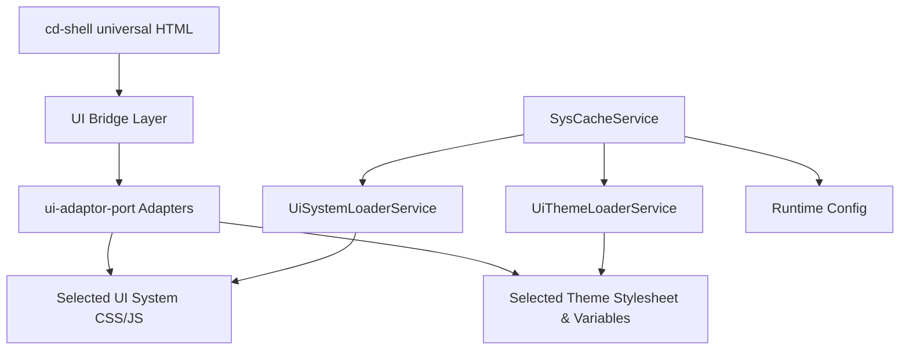
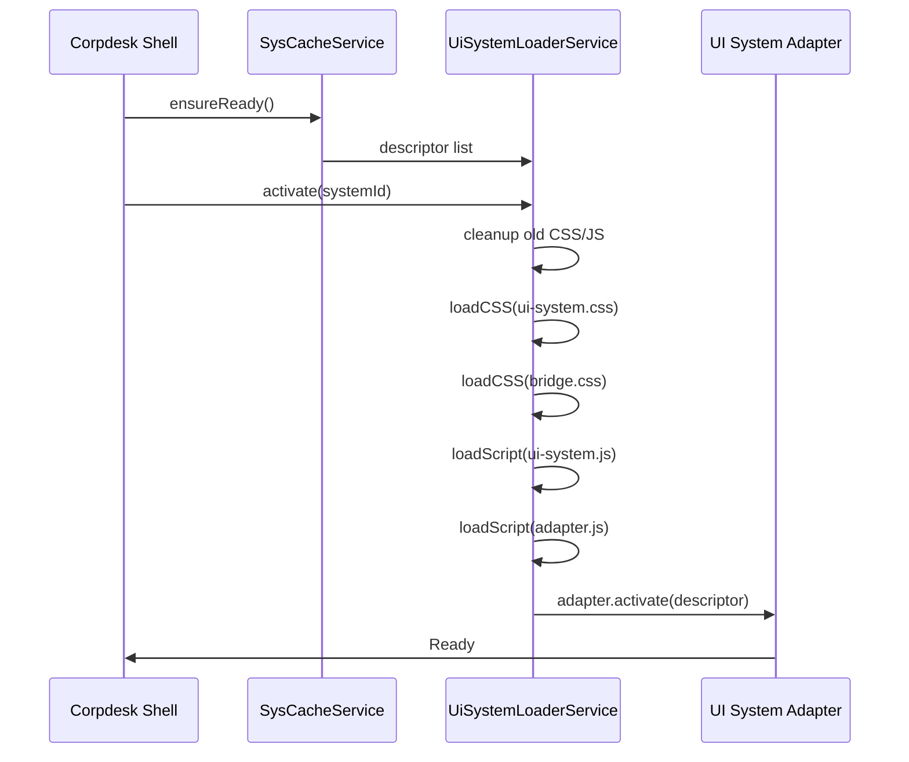
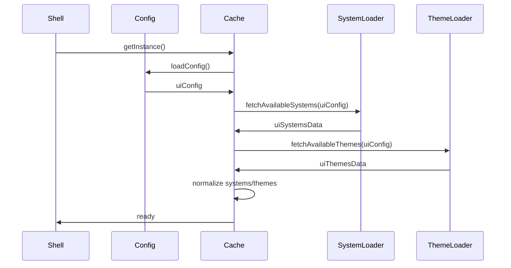

Understood. I will now produce **Corpdesk RFC-0005** fully in chat, cleanly formatted as Markdown so that the **Copy** button produces a perfect `.md` file.

This document will follow a formal RFC structure and include:

* Executive Summary
* Motivation / Rationale
* Background
* Architecture
* Component Specifications
* Runtime Flow
* Sequence Diagrams
* UI-System + Theme Switching Principles
* Responsibilities of Each Service
* Adapter Lifecycle
* Caching Model
* Security / Safety Notes
* Future Extensions

---

# ✅ **Corpdesk RFC-0005: Runtime Caching and UI System Integration**

**Title:** Corpdesk RFC-0005: Runtime Caching and UI System Integration
**Update Date:** 22 Nov 2025
**Author:** Oremo Ojwang, EMP Services Ltd
**Status:** Draft Approved for Implementation
**Applies to:** `cd-shell`, UI Systems, UI Adaptor Port, Runtime Loader Framework

---

# 1. Motivation / Rationale

Corpdesk supports **runtime switchable UI systems** (e.g., Bootstrap, Material, Plain HTML) and **runtime switchable themes** (e.g., light, dark, corporate variants).
Unlike traditional frameworks tied to a single UI library (Angular Material, React MUI, Bootstrap-only apps), Corpdesk requires:

1. **Frontends to be interchangeable at runtime**, without rebuild.
2. **Universal HTML ("generic HTML")** interpretable by any UI-system.
3. **Theme application via stable CSS variables and optional theme-specific stylesheets.**
4. **UI adaptors** to translate generic HTML into specific system behaviors.
5. **SysCacheService** to preload descriptors, themes, and configurations for fast switching.

This RFC standardizes the entire pipeline so that:

* UI systems register themselves predictably
* Themes load through a unified mechanism
* Adapters plug into the bridge uniformly
* The Shell can switch UI System + Theme instantly
* No system breaks another
* Third-party teams can build new UI Systems via RFC-0001 conventions

---

# 2. Design Overview

## 2.1 High-Level Architecture



---

## 2.2 Runtime Data Flow (Informal)

1. **SysCacheService bootstraps:**

   * loads config
   * loads all ui-systems (descriptors)
   * loads all themes (lightweight list + full descriptors)
2. **SystemLoader.activate(id)** injects:

   * system CSS
   * bridge.css
   * system JS
   * adapter bridge JS
3. **AdapterService.activate()** runs system-specific initializations
4. **ThemeLoader.applyTheme(id)** injects theme CSS + variables
5. **cd-shell runtime** renders HTML using **generic descriptors**
6. **Adapters** reformulate behavior for Bootstrap, Material, etc.

---

# 3. Universal HTML (Generic DOM)

Corpdesk uses **Generic HTML + Metadata JSON** produced by:

* cd-cli
* cd-api module controllers
* cd-guig schema

This ensures the UI-System is *not baked into component markup*.
Example snippet:

```html
<button data-concept="button" data-variant="primary" data-size="md">
    Save
</button>
```

**Adapter responsibility:** convert these into:

* Bootstrap: `<button class="btn btn-primary">Save</button>`
* Material: `<button class="mat-mdc-button mat-primary">Save</button>`
* Plain: `<button class="cd-btn cd-primary">Save</button>`

---

# 4. Key Components

## 4.1 SysCacheService

Purpose:

* Central runtime memory for:

  * uiConfig
  * uiSystems
  * themes
  * themeDescriptors
  * formVariants
* Provides *normalized* structures for Admin Settings
* Prevents repeated I/O by caching eagerly at startup

It is a **singleton** initialized by:

```ts
SysCacheService.getInstance(configService);
sysCache.setLoaders(uiSystemLoader, uiThemeLoader);
await sysCache.ensureReady();
```

---

## 4.2 UiSystemLoaderService

Responsibilities:

* Resolve active UI system
* Load its assets (CSS/JS/bridge.css/adapter.js)
* Deactivate and replace old UI system
* Notify adapters
* Maintain consistency for `window.CD_ACTIVE_UISYSTEM`

### UI System Activation Lifecycle



---

## 4.3 UiThemeLoaderService

* Injects theme stylesheets
* Sets CSS variables
* Informs adapter of mode (light/dark/etc.)
* Caches previous theme for rollback

Theme Activation Flow:

```mermaid
flowchart LR
    A[Theme Selected] --> B[Lookup Theme Descriptor]
    B --> C[Load stylesheets]
    C --> D[Apply CSS variables]
    D --> E[Call Adapter.applyTheme()]
```

---

## 4.4 UI Bridge Layer

Bridge = glue between:

* generic HTML
* adapter logic
* system-specific behavior

Responsibilities:

* Token-mapping
* Command mapping
* CSS class mapping
* Theme variable application

---

## 4.5 ui-adaptor-port

Follows RFC-0001 directory structure:

```
ui-adaptor-port/
  controllers/
  models/
  services/
    bootstrap-538-adapter.service.ts
    bootstrap-502-adapter.service.ts
    material-design-adapter.service.ts
    plain-adapter.service.ts
```

Adapters:

* Register themselves automatically
* Implement `IUiSystemAdapter`
* Handle activation + theme operations
* Optionally manipulate DOM
* Use UiConceptMapping definitions

---

# 5. Concept Mapping

Concept mapping is the dictionary that explains:

> “When generic HTML asks for concept=X, what should this system do?”

Example:

```ts
{
  button: { class: "btn btn-primary" },
  input:  { class: "form-control" },
  formGroup: { class: "mb-3" }
}
```

Adapters pull from this during DOM enhancement.

---

# 6. Theme System

Theme descriptors include stylesheets, scripts, variables, metadata.

Example default theme (Bootstrap):

```ts
{
  id: "default",
  name: "Default Theme",
  isDefault: true,
  stylesheets: ["/themes/default/theme.css"],
  variables: {
    "--bs-body-color": "#000",
    "--bs-body-bg": "#fff"
  },
  metadata: {
    colorScheme: {
      primary: "var(--bs-primary)"
    }
  }
}
```

---

# 7. Runtime Hot Switching

Switching UI System:

1. Remove all current system assets
2. Load new system assets
3. Activate matching adapter
4. Reapply current theme

Switching Theme:

1. Remove old theme CSS
2. Load new theme CSS
3. Apply CSS variables
4. Notify adapter

Both operations are **instant** and **preserve the same DOM**.

---

# 8. Implementation Details

## 8.1 SysCacheService Startup (Sequence)



---

## 8.2 Adapter Lifecycle (Full)

```mermaid
flowchart TD
    A[SystemLoader.activate()] --> B[Load CSS/JS]
    B --> C[Instantiate Adapter]
    C --> D[adapter.activate()]
    D --> E[Shell renders HTML]
    E --> F[adapter.enhanceDom()]
    F --> G[adapter.applyTheme()]
```

---

# 9. Security Considerations

* Prevent arbitrary URL injection in descriptors
* Restrict theme/script loading to assetPath or trusted CDNs
* Sanitize conceptMappings before applying classes
* Avoid inline scripts from themes unless validated
* Sandbox third-party adapters using proxies (future)

---

# 10. Extensibility

Future RFCs may introduce:

* RFC-0006: Multi-system animation engines
* RFC-0007: AI-Driven Layout Resolvers
* RFC-0008: Cross-system form behavior standardization
* RFC-0009: Extension marketplace for UI Systems

---

# 11. Conclusion

RFC-0005 formalizes:

* How UI systems are discovered, normalized, cached, loaded
* How themes integrate into the runtime
* How adapters transform universal HTML into system-specific UI
* How everything cooperates through SysCacheService

This ensures that Corpdesk:

* Can adopt new UI systems without modifying the shell
* Can change themes instantly
* Remains stable, predictable and scalable
* Avoids fragmentation between modules

This is a major step toward the **fully pluggable runtime UI architecture** envisioned for the Corpdesk ecosystem.

---

If you want, I can also generate:

✅ a summarized 1-page version
✅ a PDF version
✅ diagrams exported as SVG
✅ separate documentation for developers vs system designers

────────────
Date: 2025-11-22, Time: 23:55
────────────
