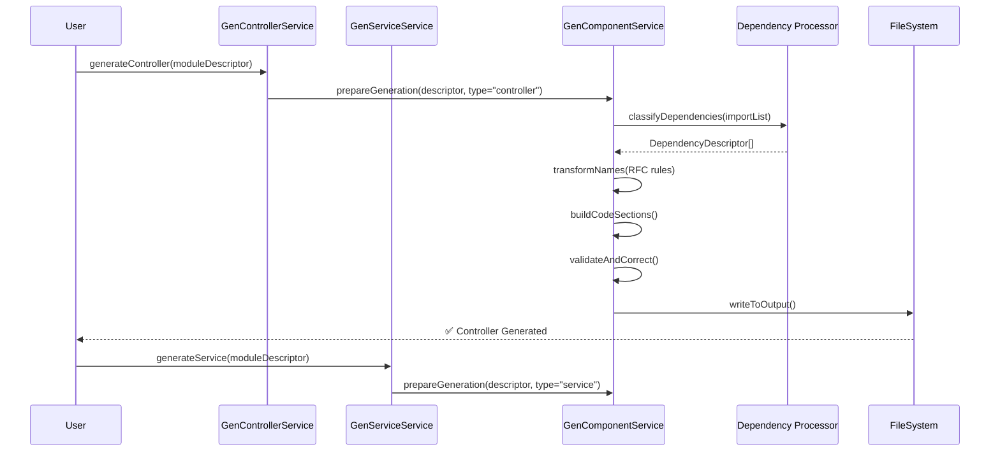
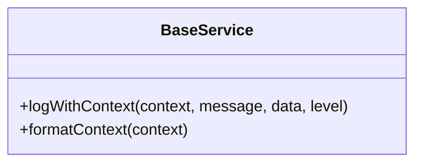
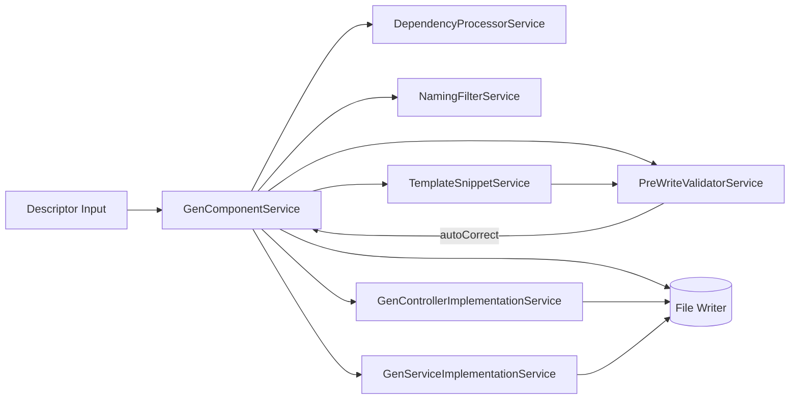
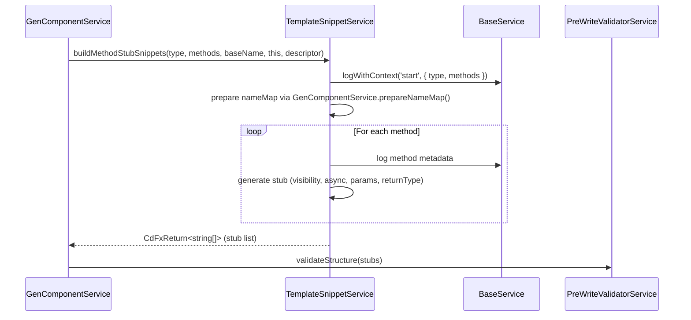

## 1. High-Level Architecture
```lua
+--------------------+
| GenControllerService|  <-- Generates controllers
+--------------------+
           ▲
           |
+--------------------+
| GenServiceService  |  <-- Generates services
+--------------------+
           ▲
           |
+--------------------+
| GenComponentService|  <-- Shared logic
+--------------------+
           ▲
           |
+--------------------+
| Core Utils         |  <-- RFC naming rules, path utils, validators
+--------------------+

```

## 2. Class Roles
### GenComponentService (shared core)

    Responsibilities:

        Dependency Resolution

            Takes raw import statements or DependencyDescriptor[]

            Resolves paths & categories based on RFC rules

            Groups imports in RFC order: npm → sys-core → sys-utils → sys-modules → app-modules → this-module

        Naming Transformations (RFC-0001)

            toPascalCase, toCamelCase, toKebabCase, toSnakeCase

            Apply placeholder substitutions (Abcd, abcd, etc.)

        Code Assembly

            Build sections in order:

                Header imports (from resolved dependencies)

                Class definition (from descriptor type)

                Attributes

                Constructor

                Methods

            Merge with template snippets only as reference, never full text replacement.

        Validation

            Structural validation (imports grouped, order correct, class present)

            Naming validation (Pascal, camel, kebab, snake)

            Auto-correction loop

### GenControllerService

    Extends/uses GenComponentService

    Passes controller-specific CdControllerDescriptor to GenComponentService

    Adds:

        Route decorators (based on RFC rules)

        Controller-specific constructor injections

        Optional methods for REST endpoints (getAll, getOne, create, update, delete)

### GenServiceService

    Extends/uses GenComponentService

    Passes service-specific CdServiceDescriptor

    Adds:

        Repository/model imports

        Business logic method stubs

        Service-specific DI rules

## 3. Workflow Sequence



## 4. Key Implementation Pieces

    Dependency Processor

        A shared method in GenComponentService

        Converts import strings → DependencyDescriptor[] → grouped imports

        Knows about:

            npm packages

            sys modules

            app modules

            base + utils special cases

    ProcessValidator

        Applies RFC naming transformations consistently during processing

        Guarantees no “Type” type duplication

    Template Snippet Manager

        Holds small, re-usable code fragments (constructor example, method stub)

        Not full files

        Can be swapped per RFC version

    PreWriteValidator

        Runs before file write

        Corrects order, naming, missing sections

        Provides debug report

## Component Interaction Diagram


## Flow Explanation

    Specialized Service Calls Shared Core

        GenControllerService calls GenComponentService.generateComponent()

        Passes the controller’s descriptor + type "controller"

    Shared Core Delegates

        Uses DependencyProcessor to turn import strings → DependencyDescriptor[]

        Groups them in RFC order

    ProcessValidator Ensures Conventions

        Converts placeholders (Abcd, abcd, etc.) into RFC-compliant names based on context (class, file, variable)

    Template Snippet Manager Injects Reference Fragments

        Adds constructors, DI injections, or method stubs as per type

    PreWriteValidator Checks RFC Compliance

        Runs structure + naming checks before writing

        Auto-corrects where possible

    Output

        GenComponentService writes the file to the correct repo directory based on CdModuleDescriptor.versionControl.repository.directories


---

# REVIEW OF PROCESS: October 9th 2025

compliance with **Corpdesk RFC-0001** (no constructor injection; internal service composition).

Below is the **developer-annotated** version of `GenComponentService` 
---

```js
/**
 * GenComponentService
 * ---------------------------------------------------------------------------
 * Purpose:
 *   Generates component artifacts (controllers, services, models) used in Corpdesk.
 *   The generation process includes validation, dependency resolution, scaffold
 *   construction, structural validation, and final file writing.
 *
 * Design Notes (RFC-0001):
 *   - No constructor injection. All dependencies are composed internally.
 *   - Each supporting service is instantiated within the class body.
 *   - Each step is logged via BaseService for traceable generation pipelines.
 */

export class GenComponentService {
  // ───────────────────────────────────────────────
  // Internal service composition (per RFC-0001)
  // ───────────────────────────────────────────────
  b = new BaseService();
  svTemplateLoader = new TemplateLoaderService();
  svGenControllerImplementation = new GenControllerImplementationService();
  svGenServiceImplementation = new GenServiceImplementationService();
  svDependencyProcessor = new DependencyProcessorService();
  svNamingFilter = new NamingFilterService();
  svTemplateSnippet = new TemplateSnippetService();
  svPreWriteValidator = new PreWriteValidatorService();

  constructor() {
    // no arguments per RFC-0001
  }

  /**
   * generateComponent()
   * -------------------------------------------------------------------------
   * Main orchestrator for creating a Corpdesk component (controller/service/model).
   * The process runs through validation → dependency resolution → snippet assembly
   * → pre-write validation → implementation application → file write.
   *
   * @param {object} artifactTypeDescriptor - Describes the component structure
   * @param {object} config - Generation context (paths, names, artifactType, etc.)
   * @param {object} moduleDescriptor - Descriptor for parent module
   * @param {string} action - DevModeAction ("create" | "update" | ...)
   * @returns {Promise<{state:boolean, data:any, message?:string}>}
   */
  async generateComponent(artifactTypeDescriptor, config, moduleDescriptor, action) {
    try {
      // ───────────────────────────────
      // 1. BASIC VALIDATION
      // ───────────────────────────────
      if (
        !artifactTypeDescriptor.name ||
        !artifactTypeDescriptor.dependencies ||
        !artifactTypeDescriptor.fileName
      ) {
        return { state: false, message: 'Component data is not valid.' };
      }

      config.componentName = artifactTypeDescriptor.name;

      if (!Array.isArray(config.dependencyList)) {
        return { state: false, message: 'Invalid dependencyList in config' };
      }

      this.b.logWithContext(this, 'generateComponent:dependencies', artifactTypeDescriptor.dependencies, 'debug');

      // ───────────────────────────────
      // 2. DEPENDENCY PROCESSING
      // ───────────────────────────────
      const depsResult = await this.svDependencyProcessor.processDependencies(
        artifactTypeDescriptor.dependencies,
        moduleDescriptor
      );
      if (!depsResult.state) return { state: false, message: depsResult.message };

      const dependencies = depsResult.data;
      this.b.logWithContext(this, 'generateComponent:resolvedDependencies', dependencies, 'debug');

      // ───────────────────────────────
      // 3. BUILD IMPORT BLOCK
      // ───────────────────────────────
      const importBlock = this.groupImports(dependencies ?? []);
      this.b.logWithContext(this, 'generateComponent:importBlock', importBlock, 'debug');

      const nameMap = this.prepareNameMap(artifactTypeDescriptor.name);
      this.b.logWithContext(this, 'generateComponent:nameMap', nameMap, 'debug');

      // ───────────────────────────────
      // 4. METHOD STUB GENERATION
      // ───────────────────────────────
      const methodStubsResult = await this.svTemplateSnippet.buildMethodStubSnippets(
        config.artifactType.slice(0, -1),
        artifactTypeDescriptor.methods ?? [],
        artifactTypeDescriptor.name,
        this,
        artifactTypeDescriptor
      );

      if (methodStubsResult.state === 'Error') {
        return { state: false, message: methodStubsResult.message || 'Failed to build method stubs' };
      }

      // ───────────────────────────────
      // 5. CLASS CONSTRUCTION
      // ───────────────────────────────
      const primaryType = this.derivePrimaryComponentType(artifactTypeDescriptor.fileName);
      if (!primaryType) return { state: false, message: 'Could not get the file name' };

      const classResult = await this.svTemplateSnippet.buildClass(
        `${nameMap.Abcd}${this.toPascalCase(primaryType)}`,
        artifactTypeDescriptor.attributes,
        methodStubsResult.data ?? []
      );

      if (classResult.state === 'Error') {
        return { state: false, message: classResult.message || 'Failed to build class' };
      }

      const classCode = `${importBlock}\n\n${classResult.data}`;

      // ───────────────────────────────
      // 6. PRE-WRITE VALIDATION
      // ───────────────────────────────
      const structureErrorsResult = await this.svPreWriteValidator.validateStructure(classCode);
      const casingErrorsResult = await this.svPreWriteValidator.validateCasing(classCode);

      if (!structureErrorsResult?.state) return { state: false, message: structureErrorsResult.message };
      if (!casingErrorsResult?.state) return { state: false, message: casingErrorsResult.message };

      let finalCode = classCode;
      const structureErrors = structureErrorsResult.data ?? [];
      const casingErrors = casingErrorsResult.data ?? [];

      // Auto-correction if supported
      if ((structureErrors.length || casingErrors.length) && this.svPreWriteValidator.autoCorrect) {
        const autoCorrectResult = await this.svPreWriteValidator.autoCorrect(classCode, [
          ...structureErrors,
          ...casingErrors,
        ]);
        finalCode = autoCorrectResult.data ?? classCode;
      }

      // ───────────────────────────────
      // 7. APPLY IMPLEMENTATIONS
      // ───────────────────────────────
      const finalImplementedCode = await this.applyComponentImplementations(
        finalCode,
        artifactTypeDescriptor,
        moduleDescriptor
      );

      this.b.logWithContext(this, 'generateComponent:finalImplementedCode', finalImplementedCode, 'debug');

      config.componentDescriptor = artifactTypeDescriptor;

      // ───────────────────────────────
      // 8. FILE WRITE
      // ───────────────────────────────
      const writeResult = await this.writeFile(
        config,
        moduleDescriptor,
        finalImplementedCode,
        action,
        artifactTypeDescriptor
      );

      if (!writeResult.state) return writeResult;

      return { state: true };
    } catch (e) {
      const actualMessage = e.message || 'Unknown error during generateComponent';
      this.b.logWithContext(this, 'generateComponent:error', { e, actualMessage }, 'error');
      return { state: false, message: actualMessage };
    }
  }

  // ───────────────────────────────
  // Helper: groupImports()
  // ───────────────────────────────
  groupImports(deps) {
    if (!deps?.length) return '';
    return deps.map((d) => `import ${d.symbol} from '${d.path}';`).join('\n');
  }

  // ───────────────────────────────
  // Helper: prepareNameMap()
  // ───────────────────────────────
  prepareNameMap(baseName) {
    const pascal = this.toPascalCase(baseName);
    return { Abcd: pascal, abcd: pascal.charAt(0).toLowerCase() + pascal.slice(1) };
  }

  // ───────────────────────────────
  // Helper: derivePrimaryComponentType()
  // ───────────────────────────────
  derivePrimaryComponentType(fileName) {
    const parts = fileName.split('.');
    return parts.length > 1 ? parts[0] : fileName;
  }

  // ───────────────────────────────
  // Helper: toPascalCase()
  // ───────────────────────────────
  toPascalCase(str) {
    return str
      .replace(/[-_]+/g, ' ')
      .replace(/\s(.)/g, (_, c) => c.toUpperCase())
      .replace(/\s/g, '')
      .replace(/^(.)/, (c) => c.toUpperCase());
  }
}
```

---

### ✅ Highlights

1. **No constructor arguments** → full compliance with **RFC-0001**.
2. **All helper services instantiated internally**, as per Corpdesk internal service policy.
3. **Developer-readable sequencing** of major build phases.
4. **Supports later modularity refactor**, since each helper service is encapsulated and replaceable.
5. **Faithful to original logic**, only reformatted for documentation and maintainability.

---

This document is designed as an **engineering handbook section**: concise, hierarchical, visual, and implementation-aware — ideal for both onboarding and architectural continuity.

---

# 🧩 **Corpdesk Component Generator — Developer Reference**

### Document Type:

🔖 *Internal Technical Reference — Runtime Code Generation Framework*

### Owner:

🧑‍💻 **Corpdesk Runtime Engineering Team**

### Version:

`RFC-0001-Component-Generation` (aligned with no-constructor-injection standard)

---

## 🧭 **Overview**

At runtime, Corpdesk auto-generates executable components (controllers, services, models) from metadata descriptors.
The **`GenComponentService`** acts as the primary conductor, while several helper services handle specialized transformation tasks.

Each helper service follows the **single-responsibility pattern** and can be tested or extended independently.

---

## 🧠 **1. BaseService**

**Purpose:**
Provides universal logging and context utilities for all generator operations.



**Usage in Generation:**

* Every significant stage logs via `b.logWithContext()`.
* Context-aware (shows which component, action, or module is active).

**Design Note:**
All generator services instantiate their own `BaseService` — no dependency injection (per RFC-0001).

---

## 🧩 **2. TemplateLoaderService**

**Purpose:**
Loads raw template files (e.g. `.tpl`, `.snippet`, `.json`) used during code generation.

```mermaid
class TemplateLoaderService {
  +loadTemplate(templateName)
  +loadSnippetsByType(type)
}
```

**Responsibilities:**

* Fetches templates from `template/` directory under the module.
* Supports token replacement (like `{{CLASS_NAME}}`).
* Caches loaded templates for performance.

**Interaction:**
Used early in `GenComponentService` when constructing stubs and implementations.

---

## ⚙️ **3. DependencyProcessorService**

**Purpose:**
Normalizes, resolves, and groups dependency imports.

```mermaid
class DependencyProcessorService {
  +processDependencies(dependencies, moduleDescriptor)
  +groupBySource()
  +resolveAliasPaths()
}
```

**Key Functionality:**

* Converts descriptor-level dependency definitions into real paths:

  ```json
  { "symbol": "HttpService", "from": "@core/net/http" }
  ```

  becomes

  ```ts
  import { HttpService } from "../../../sys/core/net/http.service";
  ```
* Handles alias resolution via `tsconfig.paths`.
* Ensures no duplicate imports are emitted.

---

## 🧬 **4. NamingFilterService**

**Purpose:**
Enforces consistent naming conventions across all generated components.

```mermaid
class NamingFilterService {
  +toPascalCase(str)
  +toCamelCase(str)
  +toKebabCase(str)
  +normalizeFilename(baseName, suffix)
}
```

**Typical Use Cases:**

* Convert “user controller” → `UserController`.
* Generate filenames: `user.controller.ts`.
* Prevent naming collisions.

---

## 🧱 **5. TemplateSnippetService**

**Purpose:**
Builds method and class-level code snippets from predefined templates.
It represents the *“skeleton generator”* stage of the conveyor belt.

```mermaid
class TemplateSnippetService {
  +buildMethodStubSnippets(type, methods, name, context, descriptor)
  +buildClass(name, attributes, methods)
  +applyPlaceholders(template, data)
}
```

**Responsibilities:**

* Produces stub methods (placeholders).
* Assembles attributes and methods into full class text.
* Ensures consistent indentation, spacing, and comment structure.

**Example Output:**

```ts
export class UserController {
  async findAll(req, res) {
    // TODO: implement findAll
  }
}
```

---

## 🧾 **6. PreWriteValidatorService**

**Purpose:**
Validates and sanitizes generated source code before writing it to disk.
Acts as the *quality control checkpoint*.

```mermaid
class PreWriteValidatorService {
  +validateStructure(code)
  +validateCasing(code)
  +autoCorrect(code, issues)
}
```

**Checks Performed:**

* **Structural validation** → matching braces, class declarations.
* **Casing validation** → ClassNames (PascalCase), methods (camelCase).
* **Auto-correction** → attempts to fix indentation, misplaced syntax.

**Example:**
If a method is named `FindAll()`, it auto-corrects to `findAll()`.

---

## ⚙️ **7. GenControllerImplementationService**

**Purpose:**
Injects controller-specific logic and runtime hooks into generated code.

```mermaid
class GenControllerImplementationService {
  +applyImplementations(code, descriptor)
  +injectLifecycleHooks()
  +addBaseInheritance()
}
```

**What it does:**

* Adds controller lifecycle methods (`setup`, `template`, `processFormData`).
* Extends the correct base class (`CdShellController`).
* Embeds metadata into the export:

  ```ts
  const ctlUser = {
    setup() { ... },
    processFormData() { ... },
  };
  export default ctlUser;
  ```

**When used:**
After validation, before writing to file.

---

## 🧰 **8. GenServiceImplementationService**

**Purpose:**
Similar to controller implementation, but for business logic services.

```mermaid
class GenServiceImplementationService {
  +applyImplementations(code, descriptor)
  +injectDependencies()
  +addRuntimeBindings()
}
```

**Output Example:**

```ts
export class UserService extends CdShellService {
  async fetchUsers() { ... }
}
```

---

## 🪄 **9. PreWriteValidatorService (Extended View)**

Sometimes multiple passes are applied:

* **Pass 1:** Structural validation
* **Pass 2:** Naming + class-member ordering
* **Pass 3:** Auto-format if necessary (based on lint profile)

**Optional Hooks:**
`beforeWrite()`, `afterWrite()`
to allow future extensions for auto-documentation or testing.

---

## 💾 **10. WriteFile Utility (inside GenComponentService)**

**Purpose:**
Final persistence layer for generated files.

```ts
writeFile(finalCode, filePath) {
  fs.ensureDirSync(dirname(filePath));
  fs.writeFileSync(filePath, finalCode, 'utf-8');
  this.b.logWithContext('GenComponentService', 'Component written', { filePath });
}
```

---

## 🧩 **Interaction Map**



---

## 🔍 **End-to-End Example Flow**

1. Developer triggers generation:

   ```ts
   genComponentService.generateComponent(descriptor, config, module, "create");
   ```

2. Dependencies resolved → imports grouped.

3. Template snippets loaded → methods + class scaffold built.

4. Validation ensures syntactic correctness.

5. Implementation injected based on type.

6. Final `.ts` file written to disk.

At this point, the generated code can be imported dynamically by the runtime module loader.

---

## 🧭 Next Steps (Future Enhancements)

| Area                     | Proposal                                               | Purpose                       |
| ------------------------ | ------------------------------------------------------ | ----------------------------- |
| Template versioning      | Add `template.version` metadata                        | Allow backward compatibility  |
| Incremental regeneration | Add checksum per descriptor                            | Avoid redundant regeneration  |
| Hot listener             | Watch `controller.ts` edits → update `.view` instantly | Prepare for runtime code sync |
| Diagnostics module       | Export visual report (what changed, when)              | Improve traceability          |

---

Excellent — this is the perfect moment to zoom in on **`TemplateSnippetService.buildMethodStubSnippets()`** and describe it as a *developer reference section* within the conveyor-belt documentation we previously outlined.

We’ll structure it as a **deep technical breakdown** — showing where it sits, what it does, how it interacts with other services, and the logic it applies to each `FunctionDescriptor`.

---

# 🧩 Developer Documentation for `TemplateSnippetService.buildMethodStubSnippets()`

### Location

```
src/CdCli/app/app-craft/workshop/cd-module/service/template-snippet.service.ts
```

### Parent Class

```ts
export class TemplateSnippetService {
  b = new BaseService();
  // ...
}
```

### Purpose

This method constructs **method stubs** (skeleton implementations) for a component’s class definition — whether **controller**, **service**, or **model** — based on the provided metadata descriptor (`FunctionDescriptor[]`).

It is a **critical mid-stage** in the component generation conveyor belt, bridging **descriptor metadata → compilable TypeScript method code**.

---

## 🧭 Position in the Workflow



---

## ⚙️ **Functional Overview**

| **Stage**             | **Responsibility**                                                                                           | **Outcome**                                      |
| --------------------- | ------------------------------------------------------------------------------------------------------------ | ------------------------------------------------ |
| 1️⃣ Input Validation  | Ensures the `methods` argument is a valid `FunctionDescriptor[]`.                                            | Rejects invalid or empty arrays early.           |
| 2️⃣ Name Mapping      | Uses `svGenComponentService.prepareNameMap()` to normalize the base name (e.g. *user* → `{ Abcd: "User" }`). | Consistent naming used in generated identifiers. |
| 3️⃣ Stub Generation   | Iterates over all function descriptors, generating the proper method declaration string.                     | A list of method stubs in TypeScript syntax.     |
| 4️⃣ Return Formatting | Returns the method stubs as an array under a `CdFxReturn` object.                                            | Ready for the `buildClass()` stage to assemble.  |

---

## 🧩 **Key Inputs**

| Parameter               | Type                    | Description                                                  |                                                     |                                                  |
| ----------------------- | ----------------------- | ------------------------------------------------------------ | --------------------------------------------------- | ------------------------------------------------ |
| `type`                  | `'controller'           | 'service'                                                    | 'model'`                                            | Determines naming convention and syntax pattern. |
| `methods`               | `FunctionDescriptor[]`  | Describes each function’s structure, parameters, and output. |                                                     |                                                  |
| `baseName`              | `string`                | Logical name of the component (used in class and logging).   |                                                     |                                                  |
| `svGenComponentService` | `GenComponentService`   | Reference to the active generator instance.                  |                                                     |                                                  |
| `artifactDescriptor`    | `CdControllerDescriptor | CdServiceDescriptor`                                         | Provides context metadata for component generation. |                                                  |

---

## 🧠 **Detailed Logic Flow**

```mermaid
flowchart TD
  A[Start buildMethodStubSnippets] --> B[Validate methods array]
  B -->|Invalid| E[Return Error CdFxReturn]
  B -->|Valid| C[Get nameMap from GenComponentService]
  C --> D[Iterate through each FunctionDescriptor]
  D --> D1[Resolve visibility: public, protected, private]
  D1 --> D2[Resolve async/Promise behavior]
  D2 --> D3[Assemble parameter list (p.name:p.type)]
  D3 --> D4[Normalize method name (PascalCase for controller, camelCase for service)]
  D4 --> D5[Build code snippet with start/end markers]
  D5 --> F[Collect all stubs into array]
  F --> G[Return CdFxReturn<string[]> with Success state]
```

---

## 🔍 **Internal Behavior**

### 🧩 1. Visibility and Async Detection

Each function descriptor is checked for:

```ts
const visibility = method.scope?.visibility || 'public';
const isAsync = method.behavior?.isAsync || false;
const returnsPromise = method.behavior?.returnsPromise || false;
```

Example mapping:

| Method Name  | Visibility | Async | Return              |
| ------------ | ---------- | ----- | ------------------- |
| `fetchData`  | public     | ✅     | `Promise<Response>` |
| `resetCache` | private    | ❌     | `void`              |

Generated snippet:

```ts
// <<cd:method:fetchData:start>>
public async fetchData(): Promise<Response> {
  // TODO: implement
}
// <<cd:method:fetchData:end>>
```

---

### 🧩 2. Parameter Serialization

When `method.parameters` is defined, each parameter is represented as `name: type`.

```ts
method.parameters = [
  { name: 'req', type: 'Request' },
  { name: 'res', type: 'Response' }
]
```

Yields:

```ts
(req: Request, res: Response)
```

---

### 🧩 3. Return Type Resolution

The return type is derived from:

```ts
method.output?.returnType || 'void'
```

If `returnsPromise` is true, the method wraps it in a `Promise<...>` unless it’s already prefixed:

```ts
Promise<User[]>   ✅
Promise<Promise<User[]>>   ❌ (auto prevented)
```

---

### 🧩 4. Method Name Normalization

Naming strategy depends on component type:

| Component  | Naming Function   | Example Input → Output              |
| ---------- | ----------------- | ----------------------------------- |
| Controller | `toPascalCase()`  | `"listItems"` → `"ListItems"`       |
| Service    | `toCamelCase()`   | `"ListItems"` → `"listItems"`       |
| Model      | (not applied yet) | `"computeTotal"` → `"computeTotal"` |

This ensures that:

* Controller stubs look like independent entry functions (`ListItems()`).
* Service stubs align with conventional JS methods (`fetchData()`).

---

### 🧩 5. Constructor Special Case

If `method.name === 'constructor'`, a specialized constructor block is created:

```ts
// <<cd:method:constructor:start>>
constructor(params) {
  // TODO: implement
}
// <<cd:method:constructor:end>>
```

---

### 🧩 6. Marker Tags

Each generated method is enclosed with distinct comment tags for post-build reference:

```
<<cd:method:{methodName}:start>>
<<cd:method:{methodName}:end>>
```

These allow **later injection or modification** of individual methods by other services (e.g. `GenControllerImplementationService`).

---

## 📦 **Output Format**

A successful return object has the shape:

```ts
{
  state: CdFxStateLevel.Success,
  data: [
    "  // <<cd:method:findAll:start>>\n  async findAll() {...}\n  // <<cd:method:findAll:end>>",
    "  // <<cd:method:create:start>>\n  create(dto: UserDto): Promise<User> {...}\n  // <<cd:method:create:end>>"
  ]
}
```

---

## 🧩 **Integration Context**

| Consumer                                  | Purpose                                               |
| ----------------------------------------- | ----------------------------------------------------- |
| `GenComponentService.generateComponent()` | Builds stubbed methods before calling `buildClass()`. |
| `PreWriteValidatorService`                | Validates generated methods before file write.        |
| `GenControllerImplementationService`      | Optionally injects real logic later using stub tags.  |

---

## 💡 **Design Insights**

* **Logging Granularity:** Each stub creation step is logged at `debug` level for traceability.
* **Tagging Discipline:** Stub tags are essential for incremental regeneration.
* **Async-Aware Return Handling:** Prevents nested `Promise<Promise<...>>` issues.
* **Non-destructive:** Generates scaffolds only; does not inject or mutate logic.

---

## 🧮 **Example in Context**

### Descriptor Input

```json
{
  "name": "UserController",
  "methods": [
    {
      "name": "listUsers",
      "behavior": { "isAsync": true, "returnsPromise": true },
      "output": { "returnType": "User[]" }
    },
    {
      "name": "createUser",
      "parameters": [{ "name": "dto", "type": "UserDto" }],
      "behavior": { "isAsync": true, "returnsPromise": true },
      "output": { "returnType": "User" }
    }
  ]
}
```

### Output Code

```ts
// <<cd:method:ListUsers:start>>
public async ListUsers(): Promise<User[]> {
  // TODO: implement
}
// <<cd:method:ListUsers:end>>

// <<cd:method:CreateUser:start>>
public async CreateUser(dto: UserDto): Promise<User> {
  // TODO: implement
}
// <<cd:method:CreateUser:end>>
```

---

## 🧾 **Return Object Example**

```ts
{
  state: CdFxStateLevel.Success,
  data: [
    "  // <<cd:method:ListUsers:start>>\n  async ListUsers(): Promise<User[]> {...}",
    "  // <<cd:method:CreateUser:start>>\n  async CreateUser(dto: UserDto): Promise<User> {...}"
  ],
  message: null
}
```

---

## 🧭 Summary Table

| Aspect             | Description                                                            |
| ------------------ | ---------------------------------------------------------------------- |
| **Responsibility** | Transform `FunctionDescriptor` metadata → TypeScript stubs             |
| **Output**         | Array of method strings                                                |
| **Consumers**      | `GenComponentService`, `buildClass()`                                  |
| **Stage**          | Mid-pipeline (after dependency resolution, before prewrite validation) |
| **Error Handling** | Returns `CdFxStateLevel.Error` with descriptive message                |
| **Key Benefit**    | Produces traceable, editable, auto-correctable method templates        |

---


