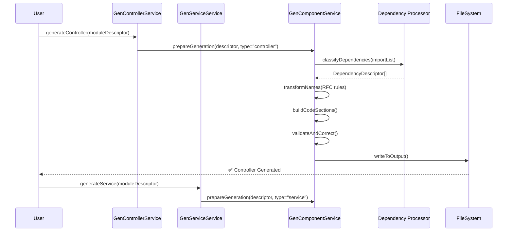
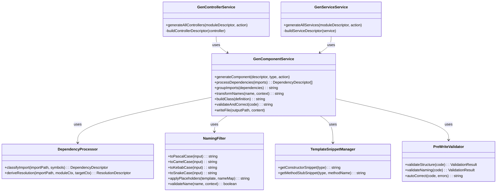

## 1. High-Level Architecture
```lua
+--------------------+
| GenControllerService|  <-- Generates controllers
+--------------------+
           ▲
           |
+--------------------+
| GenServiceService  |  <-- Generates services
+--------------------+
           ▲
           |
+--------------------+
| GenComponentService|  <-- Shared logic
+--------------------+
           ▲
           |
+--------------------+
| Core Utils         |  <-- RFC naming rules, path utils, validators
+--------------------+

```

## 2. Class Roles
### GenComponentService (shared core)

    Responsibilities:

        Dependency Resolution

            Takes raw import statements or DependencyDescriptor[]

            Resolves paths & categories based on RFC rules

            Groups imports in RFC order: npm → sys-core → sys-utils → sys-modules → app-modules → this-module

        Naming Transformations (RFC-0001)

            toPascalCase, toCamelCase, toKebabCase, toSnakeCase

            Apply placeholder substitutions (Abcd, abcd, etc.)

        Code Assembly

            Build sections in order:

                Header imports (from resolved dependencies)

                Class definition (from descriptor type)

                Attributes

                Constructor

                Methods

            Merge with template snippets only as reference, never full text replacement.

        Validation

            Structural validation (imports grouped, order correct, class present)

            Naming validation (Pascal, camel, kebab, snake)

            Auto-correction loop

### GenControllerService

    Extends/uses GenComponentService

    Passes controller-specific CdControllerDescriptor to GenComponentService

    Adds:

        Route decorators (based on RFC rules)

        Controller-specific constructor injections

        Optional methods for REST endpoints (getAll, getOne, create, update, delete)

### GenServiceService

    Extends/uses GenComponentService

    Passes service-specific CdServiceDescriptor

    Adds:

        Repository/model imports

        Business logic method stubs

        Service-specific DI rules

## 3. Workflow Sequence



## 4. Key Implementation Pieces

    Dependency Processor

        A shared method in GenComponentService

        Converts import strings → DependencyDescriptor[] → grouped imports

        Knows about:

            npm packages

            sys modules

            app modules

            base + utils special cases

    ProcessValidator

        Applies RFC naming transformations consistently during processing

        Guarantees no “Type” type duplication

    Template Snippet Manager

        Holds small, re-usable code fragments (constructor example, method stub)

        Not full files

        Can be swapped per RFC version

    PreWriteValidator

        Runs before file write

        Corrects order, naming, missing sections

        Provides debug report

## Component Interaction Diagram



## Flow Explanation

    Specialized Service Calls Shared Core

        GenControllerService calls GenComponentService.generateComponent()

        Passes the controller’s descriptor + type "controller"

    Shared Core Delegates

        Uses DependencyProcessor to turn import strings → DependencyDescriptor[]

        Groups them in RFC order

    ProcessValidator Ensures Conventions

        Converts placeholders (Abcd, abcd, etc.) into RFC-compliant names based on context (class, file, variable)

    Template Snippet Manager Injects Reference Fragments

        Adds constructors, DI injections, or method stubs as per type

    PreWriteValidator Checks RFC Compliance

        Runs structure + naming checks before writing

        Auto-corrects where possible

    Output

        GenComponentService writes the file to the correct repo directory based on CdModuleDescriptor.versionControl.repository.directories