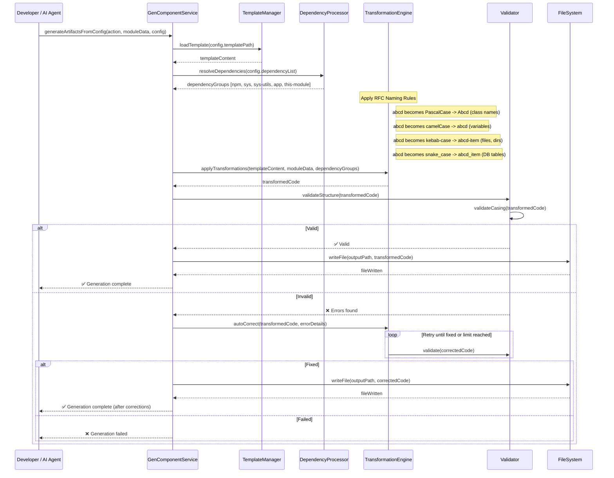

# Guide for Automatic Codes.

## 1. RFC Reference

Before writing any scaffolded code, the machine or developer must fully understand the Corpdesk RFC. The RFC defines the required **structure, naming conventions, and code organization** rules.

## 2. Templates as Reference (Not Just Text Conversion)

Templates are **reference blueprints** and **rule reminders**. The placeholder `abcd` represents the name of a given item and must be transformed according to context using the RFC.

**Key point**: Always refer to the RFC to determine the correct case and naming convention.

## 3. `CdModuleDescriptor`

The `CdModuleDescriptor` contains information about the module being scaffolded. This informs naming, imports, and structure.

## 4. Code Sections

### a. Header for Imports

Types of imports:

* **npm**: From npm packages
* **corpdesk-sys**: From `sys` directory
* **corpdesk-sys-utils**: From `sys/utils` directory
* **corpdesk-app**: From `app` directory
* **this-module**: From the same module
* **Extra header data**: Any non-import header data (comments, metadata)

Imports are guided by the `DependencyDescriptor` interface, which is related to `CdModuleDescriptor`.

### b. Class Definitions

* **Controller**: `CdControllerDescriptor`
* **Service**: `CdServiceDescriptor`
* **Model Entity**: `CdModelDescriptor`

### c. Version Control

* **Directories**:

  * Source of templates
  * Workshop output directory
  * Test-bed
  * Sandbox

## 5. Naming Transformation Rules

| Context             | Rule        | Example           |
| ------------------- | ----------- | ----------------- |
| Class names         | PascalCase  | `AbcdService`     |
| Variables           | camelCase   | `abcdService`     |
| Files & directories | kebab-case  | `abcd-service.ts` |
| DB table names      | snake\_case | `abcd_service`    |

## 6. Validation Process

Validation is split into two stages:

### Stage 1: Structure Validation

* Import block order & grouping
* Required headers present
* Class declaration present
* File naming conventions match RFC

### Stage 2: Casing Validation

* Imports: paths kebab-case, entities PascalCase
* Class names: PascalCase
* Method names: camelCase (private), PascalCase (public API)
* Instance variables: camelCase

## 7. Correction Loop

If validation fails:

1. Identify errors.
2. Apply corrections.
3. Revalidate.
4. Repeat until fixed or a retry limit is reached.

---

## Mermaid Sequence Diagram

