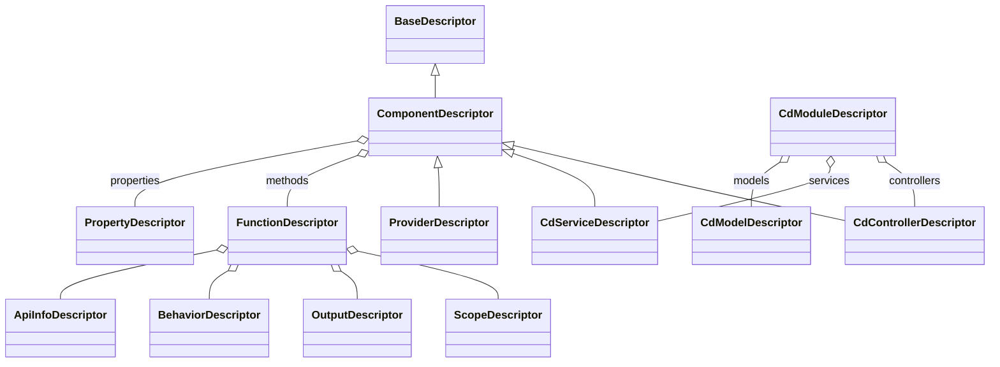

# 📘 Corpdesk Descriptors Architecture

> **Version:** `v1.0`  
> **Status:** Draft  
> **Author:** George Oremo, Corpdesk  
> **Last Updated:** June 20, 2025  

---

## 🧭 Introduction

In Corpdesk, **descriptors** are the foundational abstraction for representing the structure, intent, and metadata of application components — such as modules, services, controllers, models, functions, and properties — in a **machine-readable format**.

Descriptors serve as **structured contracts** that power automation across:

- Module scaffolding via `cd-cli`
- Programmatic code generation
- Deployment workflows
- Documentation and introspection
- Runtime reflection (future goal)

At their core, descriptors allow Corpdesk to **treat code as data** — enabling AI assistance, code orchestration, and self-describing software architecture.

---

## 🎯 Objectives of the Descriptor System

- ✅ Provide a **uniform schema** for describing different kinds of software components.
- ✅ Enable **declarative development** using CLI and workflow tools.
- ✅ Power **automated generation** of services, controllers, models, APIs, and DB schemas.
- ✅ Maintain clear separation between **code** and **metadata**, yet support their synchronization.
- ✅ Allow **progressive introspection** and documentation.

---

## 📐 Original Descriptor Structure

Initially, Corpdesk descriptors were purpose-specific:

- `CdModuleDescriptor` — described a module's structure.
- `CdControllerDescriptor` — defined controller metadata and actions.
- `CdServiceDescriptor` — focused on services and their methods.
- `CdModelDescriptor` — captured model fields and types.
- `FunctionDescriptor` — defined functions, typically used in actions and methods.

Each descriptor mirrored a real-world code entity, tightly coupled to its role.

---

## 🔄 The Need for Generalization

As the Corpdesk architecture matured, a key realization emerged:

> Many entities (controllers, services, providers, helpers) share a **common identity** — they are *components*, often implemented as *classes*, that expose *properties*, *methods*, and *metadata*.

This called for a **unified abstraction**:  
### ➡️ `ComponentDescriptor`

---

## 🆕 `ComponentDescriptor`: A Unified Architecture Model

The `ComponentDescriptor` generalizes all class-like or logic-bearing components in the Corpdesk ecosystem.

```ts
export interface ComponentDescriptor extends BaseDescriptor {
  name: string;
  type?: 'class' | 'module' | 'function' | 'provider' | 'config';
  description?: string;
  properties?: PropertyDescriptor[];
  methods?: FunctionDescriptor[];
  annotations?: string[];
  extends?: string;
  implements?: string[];
  dependencies?: DependencyDescriptor[];
  filePath?: string;
}
```

📌 Inheritors

    CdControllerDescriptor extends ComponentDescriptor

    CdServiceDescriptor extends ComponentDescriptor

    Future: ProviderDescriptor, ConfigDescriptor, MiddlewareDescriptor, etc.

📊 Mermaid Diagram — Descriptor Hierarchy



This class diagram shows how all high-level automation metadata in Corpdesk descends from the BaseDescriptor, converging into a centralized modeling abstraction through ComponentDescriptor.

🧪 Usage in Practice

This abstraction allows the Corpdesk tooling (cd-cli, app-craft, cd-shell, etc.) to:

    Generate class-based files (controller, service, model) dynamically.

    Inspect components during runtime or build time.

    Maintain full structural awareness for IDEs, docs, AI tools.

    Migrate or serialize descriptor trees to config files or manifests.

Example: A controller scaffold can now be generated from:
```ts
const descriptor: CdControllerDescriptor = {
  name: 'UserController',
  type: 'class',
  methods: [...],
  properties: [...],
  annotations: ['@Controller()'],
};
```

🌅 Looking Ahead

The ComponentDescriptor paves the way for:

    🔍 Full AST reflection and class reconstruction

    📦 Exportable component.manifest.json per module

    🔁 Runtime plugin orchestration

    🧠 AI-powered code introspection and refactoring

    📄 Auto-generated architecture diagrams

    🌐 Integration with frontend (e.g., cd-pwa) components

✅ Conclusion

The evolution toward ComponentDescriptor marks a pivotal shift in the Corpdesk architecture — enabling modular, descriptive, and scalable automation of application logic. This refinement unlocks clearer modeling, easier tooling, and future compatibility with dynamic runtimes and AI agents.

---

**Date: 2025-06-20, Time: 05:05**  


